# Introducción a Nodejs


## ¿Qué es Nodejs?

### Conceptos

Para poder entender el concepto de node, primero vamos a tener que conocer otros conceptos más básicos sobre estos temas:

* Procesadores
* Lenguaje de máquina
* C++

Podemos pensar a procesador (microprocesador) como una pequeña máquina que recibe impulsos eléctricos como entrada y genera salidas al que nosotros le pasamos _instrucciones_. Pero el procesador no entiende cualquier lenguaje, sólo habla _lenguaje de máquina_ (es un lenguaje binario, secuencia de unos y ceros) y que está detallado en lo que se conoce como set de instrucciones. Como se imaginarán cada fabricante tiene set de instrucciones distintos y por lo tanto distintos lenguajes, mencionemos algunos:

* IA-32
* x86, x86-64
* ARM
* MIPS

Para pasarle intrucciones al procesador, no escribimos 1's y 0's, sino que usamos un lenguaje que se traduce directamente a esa secuencia, llamado [__assembler__](https://es.wikipedia.org/wiki/Lenguaje_ensamblador). 


Hoy en día no se programa en assembler ([__lenguaje de bajo nivel__](https://es.wikipedia.org/wiki/Lenguaje_de_bajo_nivel)), ya que es muy complejo y hacer un simple 'Hello World' podría llevar muchas líneas de código: Simplemente no escala. Para solucionar esto, se crearon lenguajes más fáciles y rápidos de programar y que compilan a lenguaje de máquina, estos son los conocidos _lenguajes de alto nivel_, JAVA, C++, Javascript son ejemplos de estos lenguajes. Es importante notar, que no importa que lenguaje usemos, en algún momento el código será _traducido_ o _compilado_ a lenguaje de máquina, que es el único lenguaje que entiende verdaderamente la computador.

Como pueden pensar mientras nos alejamos del lenguaje de máquina (lenguajes de más alto nivel) y nos abstraemos vamos ganando velocidad para codear, pero también vamos perdiendo performance. Piensen que si codeamos en lenguaje de máquina, podemos controlar cada slot de memoria nosotros mismos y hacerlo de la mejor forma posible. Cuando subimos de nivel, alguien hace ese trabajo por nosotros, y como tiene que ser genérico no puede lograr ser tan óptimo. Es por eso que según la performance y los recursos que se necesite o tengamos vamos a elegir lenguajes de altisimo o bajísimo nivel. 


_Por ejemplo, los microcontroladores embebidos en lavaropas están programados en C compilado a lenguaje de máquina, esto es porque tienen muy poca memoria y tienen que optimizarla al máximo_

#### C++

[C++](https://es.wikipedia.org/wiki/C%2B%2B) es un lenguaje de programación de bajo nivel, estaría justo por arriba de Assembly. Este lenguaje se hizo muy popular porque es fácil para codear, pero a su vez te deja tener bastante control sobre lo que está pasando en nivel hardware. Muchos otros lenguajes se construyeron en base a C++, o siguiendo sus sintaxis o usándolo en su cadena de abstracción.

Justamente _Nodejs_ está programado en _C++_!
La razón por la que nodejs está escrito en _C++_ es porque __V8__ está escrito en _C++_, ahora veamos qué es V8.

## Motor de Javascript

Antes que nada es importante entender que el lenguaje JavaScript está basado en un standart que se conoce como __ECMASCRIPT__. Este standart setea las bases de qué cosas deberá hacer el lenguaje y cuales no, y de qué manera. Ahora bien, en el mundo real no se respetan los estándares al 100%, es por eso que hay muchas implementaciones distintas de JavaScript, que va a interpretar (convertir el código a lenguaje que pueda ser corrido por la compu) el código de una manera particular, estas implementaciones son los llamados _motores javascript_.

[Ve ocho](https://en.wikipedia.org/wiki/V8_(JavaScript_engine) ) es el motor de javascript creado por __Google__ para su browser _Chrome_. Es un proyecto Open Source asi que podemos investigar su [código](https://chromium.googlesource.com/v8/v8.git), en su página Google define a v8 como:

* V8 JavaScript Engine: _ya sabiamos_.

* V8 is Google's open source JavaScript engine: _really?_.

* V8 implements ECMAScript as specified in ECMA-262: _ah!, sigue estándares, bien!._

* V8 is written in C++ and is used in Google Chrome, the open source browser from Google: _Alguien conoce ese browser Chrome, es bueno?_.

* V8 can run standalone, or can be embedded into any C++ application: _Atención con esto, se puede embeber (usar) en cualquier aplicación C++_

Releamos el último bullet en detalle: Es Standalone, eso quiere decir que puedo bajar V8 y correrlo en mi compu, no necesariamente dentro del browser, genial!; puede ser embebido, es decir que puedo codear una aplicación en _C++_ y agregarle todas las funciones de _V8_, copado!! Ya se imaginan donde empezó a nacer _Nodejs_??

Sí! Nodejs es justamente una aplicación escrita en _C++_ que embebe el motor _V8_ en su código. Por lo tanto puede interpretar código javascript, 'traducirlo' a lenguaje de máquina y finalmente ejecutarlo.
Pero eso no es lo mejor de nodejs, lo mejor es que el creador agregó algunos features que no están definidos en el estándar. Javascript originalmente estaba diseñado para correr en el browser, o sea que nadie pensó en que pudiera leer archivos, o conectarse a una base de datos, etc...
Justamente estas features son las que Nodejs agrega usando código C++. O sea, crea nuevas funciones Javascript que envuelven en realidad funciones de C++, como por ejemplo la función de leer un archivo del filesystem.

Esto hace que NodeJs sea muy poderoso! De hecho, gracias a esto NodeJs tiene todas las features necesarias para poder manejar un servidor.

* Maneras de organizar nuestro código para que sea reusable
* Poder leer y escribir archivos ( input/output)
* Leer y escribir en Bases de Datos
* Poder enviar y recibir datos de internet
* Poder interpretar los formatos estándares
* Alguna forma de manejar procesos que lleven mucho tiempo

## Instalar Nodejs

Para instalar node vamos a ir [acá](https://nodejs.org/en/) y seguir las instrucciones según el sistema operativo ques estés usando.

Una vez terminada la instalación, podemos probar si funciona correctamente escribiendo el siguiente comando en la consola:

```
node -v
```

Si el resultado es algo de la forma: `v6.3.1` entonces habremos instalado Node de manera correcta!

## Core libraries

Nodejs cuenta con un set de librerias ( les vamos a llamar módulos) que vienen por defecto en la instalación. Básicamente es código escrito para hacer tareas muy comunes.
Podemos separar estas librerias en las que están escritas en _C++_ y las que son nativas o están escritas en _javascript_.

### C++

Como dijimos antes, usando el motor _V8_ los desarrolladores de Nodejs agregaron funcionalidad que ECMAscript no tenia en el standar. La mayoría de estas funciones tiene que ver con tareas que también involucran al Sistema operativo, como leer archivos, mandar y recibir datos por la red, comprimir y descomprimir archivosy otras de manejo de streams.

### Javascript

Estas librerías están escritas en Javascript, algunas de ellas implementan la funcionalidad usando javascript, pero la mayoría son sólo envoltorios a las funciones escritas en _C++_ para que puedan ser fácilmente utilizadas por los desarrolladores de Nodejs. Estás son el tipo de librerías que podrías haber escrito vos mismo, por suerte alguien ya se tomó el trabajo!

## Organizando nuestro código en Nodejs

Una de las features que hizo que Nodejs creciera tanto, es justamente el ecosistema de librerias desarrolladas por los usuarios, que sumadas a las librerias _Core_ hacen que sea muy potente.
Ahora vamos a ver cómo poder utilizar módulos en nuestro código, y luego veremos cómo instalar módulos externos.

### Módulos

Def: Un bloque de código reusable, cuya existencia no altera accidentalmente el comportamiento de otros bloques de código.
Este concepto ya existia en otros lenguajes de programación y era muy usado para estructurar proyectos. De todos modos, los módulos no eran parte del standart en ECMAscript (lo agregaron en la última versión), pero Nodejs lo introdujo bajo el nombre de _Commonjs Modules_, que era básicamente un acuerdo (un standart) sobre cómo deberían estar estructurados los módulos.

### Cómo funciona CommonJs Modules?

Básicamente, el standart dice lo siguiente:

- Cada archivo es un ḿodulo, y cada módulo es un archivo separado.
- Todo lo que queremos exportar va a ser expuesto desde un único punto.

Para entender el standart tenemos que tener dos conceptos en claro:

* First-Class Functions: Las funciones en javascript son tratadas igual que cualquier otro objeto, es decir que podés guardarlas en variables, pasarlas como argumentos, guardarlas en arreglos, etcs...
* Function Expressions: Como las funciones son first-class, al escribir una expresión de funcion estoy creando la misma, eso quiere decir que puedo crear funciones en cualquier parte del código. 

Vamos a empezar construyendo nuestro propio módulo! una vez que lo tengamos, vamos a ver como usarlo. Entendiendo así todo el ciclo.

#### Construyendo un módulo

Empezamos con un un archivo `js` vacío. Lo llamaremos `hola.js`, esté será nuestro primer módulo. Lo único que hará este módulo es saludar:

```javascript
console.log('Hola!');
```

Tambien vamos a crear un archivo `js` que se llame `app.js`, en donde vamos a utilizar el código de `hola.js`. Dentro de `app.js` vamos a llamar a la función __require__ que es parte de las core libraries de Nodejs:

```javascript
require('./hola.js');
```

__Require__ recibe como argumento, un string que es el path en donde encontrará el código o el módulo que queremos agregar, en este caso como `hola.js` está en la misma carpeta el path es: `./hola.js`.

Ahora, si corremos el archivo `app.js` usando `node app.js` en la terminal vamos a ver que se ejecutó el código que escribimos en `hola.js`:

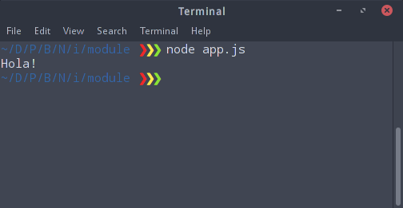

Hagamos algo más interesante, vamos a `hola.js` y creemos una función y luego la usemos para saludar:

```javascript
var saludar = function() {
	console.log('Hola!!!');
}
saludar();
```

Corramos de nuevo `app.js`:

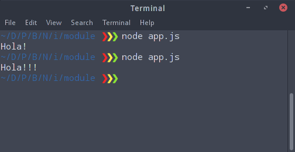

El resultado es el mismo!
Ahora, si no invocamos `saludar()` dentro de `hola.ja`, creen que la podremos invocar (usar) en `app.js`? Hagamos la prueba!

Comentamos la invocación en `hola.js`:
```javascript
var saludar = function() {
	console.log('Hola!!!');
}
//saludar();
```
Invacamos en `app.js`:
```javascript
require('./hola.js');
saludar();
```

saludar no está definido! recibimos un error. De hecho, esto está bien que suceda. Se acuerdan que dijimos que un módulo no debería afectar otro código accidentalmente? Eso quiere decir que el código está protegido y que no podemos simplemente usarlo y acceder a los objetos fuera de ese módulo.


Para usarlo afuera, vamos a tener que explicitarlo, veamos como hacer que podamos usar `saludar()` desde `app.js`.

Nodejs nos permite hacerlo usando `module.exports`, que es una variable especial cuyo objetivo es pasar su contenido a otro pedazo de código cuando llamamos a `require`:

```javascript
var saludar = function() {
	console.log('Hola!!!');
};

module.exports = saludar;
```
Ahora este módulo está exponiendo el objeto `greet`. Para usarlo en nuestro módulo tenemos que guardar lo que devuelve `require` en una variable (puedo llamar a la nueva variable como quiera):

```javascript
var hola = require('./hola.js');

hola();
```

Ahora voy a poder invocar `hola()`, porque lo hemos pasado a través de `module.exports`. Si ejecuto `app.js`:

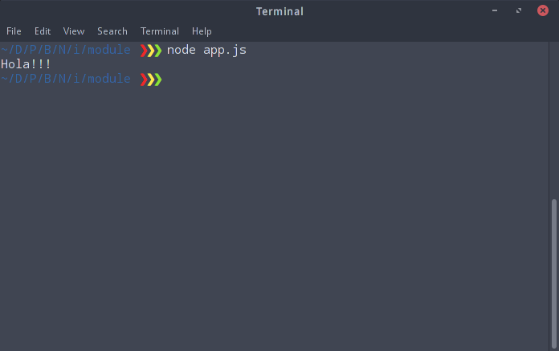

Ahora pudimos acceder al código de `hola.js`, porque lo expusimos a propósito.

Resumiendo:

- __Require__ es una función que recibe un _path_.
- __module.exports__ es lo que retorna la funcion _require_.

#### Algunos patrones de Require.

Como siempre en Nodejs, hay muchas formas de hacer lo mismo (esto puede ser bueno o malo - según cómo lo usemos) y crear módulos no es la excepción. Veamos algunos patrones comunes en la creacion de módulos!

##### Múltiples imports

La función _require_ busca primero un archivo con el nombre que le pasamos en la carpeta que le pasamos (de hecho no es necesario poner la extensión '.js'). Si no encuentra ese archivo, entonces busca una carpeta con ese nombre y busca un archivo `index.js` el cual importa. Esta funcionalidad la podemos para usar como patrón para importar varios archivos: dentro de `index.js` importamos los demás archivos.

Imaginemos que queremos hacer una función que salude en distintos idiomas, vamos a tener un `app.js` de esta forma:

```javascript
var saludos = require('./saludos');

saludos.english();
saludos.spanish();
```

Estamos importanto solamente el path `./saludos`, como no hay ningún archivo `.js` con ese nombre, _require_ busca una carpeta, por lo tanto vamos a crear una carpeta `saludos` con los siguientes archivos:

index.js
```javascript
var english = require('./english');
var spanish = require('./spanish');

module.exports = {
	english: english,
	spanish: spanish	
};
```

En este archivo estamos importando otros dos módulos, uno por cada idioma en el que queremos saludar. Lo bueno de esto, es que es va a ser muy fácil agregar y sacar idiomas de nuestra aplicación, ya que solo debemos agregar o borrar los idiomas que exportamos!

Ahora veamos como sería cada idioma:

spanish.js
```javascript
var saludos = require('./greetings.json');

var greet = function() {
	console.log(saludos.es);
}

module.exports = greet;
```
english.js
```javascript
var saludos = require('./greetings.json');

var greet = function() {
	console.log(saludos.en);
}

module.exports = greet;
```

y en greetings.json vamos a tener los saludos per se:

```javascript
{
	"en": "Hello",
	"es": "Hola"
}
```

Si ejecutamos nuestra `app.js`:

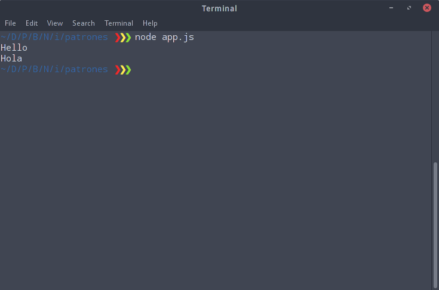

##### Más Patrones

En la carpeta `./patrones/otro` hemos puesto varios files distintos llamados `saludos` que van del uno al cinco, y luego los importamos en el archivo `app.js`. En cada módulo exportamos lo que necesitamos de manera distinta, cada uno de esas formas constitute un patrón.

Dentro de cada archivo en los comentarios está explicado en más detalle el patrón.

De nuevo, __no hay una mejor forma, prueben todos los patrones y vean cual es el que les gusta y cual los hace felices!__


### Require con modulos Core o nativos

También podemos importar módulos CORE (los que hablamos al principio) usando _require_. Esta función está preparada para que si no encuentra un archivo con el nombre que le pasamos, busca una carpeta, y si no encuentra busca en los módulos nativos.
Podemos ir a la [documentación](https://nodejs.org/dist/latest-v6.x/docs/api/) y ver los módulos que podemos usar.

Veamos como podemos importar algo de esa funcionalidad. Como ejemplo vamos a importar el módulo llamado [`utilities`](https://nodejs.org/dist/latest-v6.x/docs/api/util.html), en la doc vemos que el módulo se llama `util`.
Por lo tanto lo vamos a importar escribiendo

```javascript
var util = require('util'); // No usamos ./ porque es un modulo core 

var nombre = 'Toni';
var saludo = util.format('Hola, %s', nombre);
util.log(saludo);
```

¿Que hace este código? Busquen en la [documentación](https://nodejs.org/dist/latest-v6.x/docs/api/util.html#util_util_format_format) por la función `format()` y `log()` e intenten predecir que hará ese código.


### Eventos: Events emitter

Una gran porción del core de Nodejs está construida usando como base este concepto.
Un _Evento_ es algo que ha ocurrido en nuestra aplicación y que dispara una acción. Este concepto no es exclusivo a _Nodejs_, si no que aparece en muchos lenguajes y arquitecturas de software.
En Node hay dos tipo de eventos:

- Eventos del sistemas: Estos vienen del código en _C++_, gracias a una librería llamada _libuv_ y manejan eventos que vienen del sistema operativo como por ejemplo: Termine de leer una archivo, o recibí datos de la red, etc...
- Eventos Customs: Estos eventos estan dentro de la parte Javascript del Core. Maneja eventos que podemos crear nosotros mismos, para eso vamos a usar el _Event Emitter_. Varias veces cuando un evento de _libuv_ sucede, genera un evento usando el _event emitter_.

_Ejercicio_ Crear un forma simple de emitir eventos y capturarlos.

#### Event Listener

Dijimos que cuando ocurre un evento, queremos capturarlo y responder de alguna forma, para eso vamos a hacer uso de los _Events Listeners_, básicamente es el código _escucha_ por un evento y que hace algo (ejecuta código) cuando ese evento sucede. Podemos tener varios listeners escuchando el mismo evento.

### Event Loop

Repasemos como funcionaba V8 internamente y veamos qué es exactamente el __event loop__:

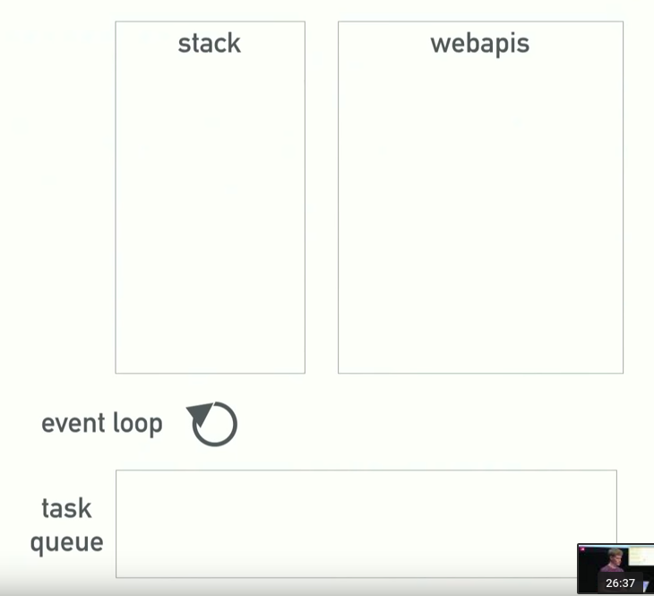

Los componentes que vemos en la figura son:

* Stack: es el runtime de V8, éste va leyendo el código del programa que esté corriendo y va poniendo cada instrucción en el stack para ejecutarla. __Javascript es Single threaded, o sea que sólo puede ejecutar una instrucción a la vez__

* SO / Webapis: Esta pila es manejada por el sistema Operativo. Básicamente V8 le delega tareas al SO, por ejemplo: Bajame esto de internet, o leeme este archivo, o comprimí esta imagen, etc... __El SO puede hacer estas tareas en un thread o varios, es transparente para nosotros__. Lo único que nos importa es cuando el SO _completó_ la tarea que se le pidió. Cuando lo hizo, nos avisa y pasa el _callback_ al task queue.

* Task Queue: Cuando el SO nos indica que terminó una tarea, no podemos simplemente pasar el _callback_ al stack de JS (no sabemos que está haciendo y podría correr código en un momento inoportuno), por lo tanto, lo que hace es dejar el callback en el _Task Queue_ ( es una pila tipo FIFO ). Ahora, cuando el Stack JS está vació el TANTAN TATAN... __EVENT LOOP__ agarra el _callback_ del Queue y lo pasa al Stack JS para ser ejecutado!

Toda esta interacción con el SO, el manejo del Task Queue y el Evento loop está implementado en la libreria [__libuv__](http://docs.libuv.org/en/v1.x/) que es la piedra angular de Nodejs. De hecho, su logo es un Unicornio T-rex, es demasiado copada:


# ¿Qué es un gestor de paquetes?

Primero definamos lo que es un paquete. Básicamente es.. `código`! Es cualquier pieza de **código** manejada y mantenida por un gestor de paquetes.

Ahora, un gestor de paquetes es un software que automatiza la instalación y actualización de paquetes. Maneja qué version de los paquetes tenes o necesitas y maneja sus _dependencias_. Una **dependencia** es código del cual dependen uno o más pedazos de código para funcionar. Por ejemplo, si usás `fs` en tu servidor, entonces `fs` es una dependecia de tu server. Sin el código de `fs` tu servidor no podría ejecutarse. De hecho, cada paquete podría tener sus propias dependecias, es por esto que manejarlos a mano se podría volver un poco engorroso, por suerte tenemos los gestores de paquetes que nos solucionan este problema.

## NPM: Node Package Manager

Npm es el gestor de paquetes que viene con Nodejs y que gestiona los paquetes para este. Para probar si tenés npm podés hacer `npm -v` en tu consola, y si recibis algo como esto: `3.10.5` quiere decir que lo tenés instalado.

Para ver el registro de paquetes podés ir a [esta](https://www.npmjs.com/) página. Acá podés buscar paquetes individuales, ver su información y bajarlos. Cualquiera puede subir sus paquetes en npm, así que tenés que tener cuidado con qué paquetes bajar.

Para instalar un paquete se utiliza el comando `npm` con el argumento `install` y el nombre del paquete. Por ejemplo, para instalar el paquete 'express' vamos a la consola y tipeamos: `npm install express`.

Para poder trackear las dependencias y los paquetes que tenemos instalados, npm hace uso de un archivo de _configuración_ al que llama **package.json**. Este es básicamente un archivo de texto en formato JSON con el listado de dependencias de tu aplicación, de esta forma con sólo compartir ese archivo cualquiera sabrá qué paquetes se deben instalar, e incluso hacerlo de forma automática.

Para crear este archivo npm nos da el comando `npm init`, que es una forma interactiva de crear el 'package.json'.

* entry point: Indica cúal es el archivo javascript que Node debe correr para arrancar la aplicación.

En la imagen vemos los datos que nos piden y a continuación vemos el archivo `package.json` que creó el comando:

```javascript
{
  "name": "test-app",
  "version": "1.0.0",
  "description": "Esta es una aplicación de prueba",
  "main": "index.js",
  "scripts": {
    "test": "echo \"Error: no test specified\" && exit 1"
  },
  "keywords": [
    "Prueba"
  ],
  "author": "Toni Tralice",
  "license": "ISC"
}
```

Para que veamos como funcionan las dependencias, vamos a instalar algunos paquetes y requerirlos dentro de nuestra aplicación de prueba.

_Los paquetes instalados de forma local serán guardados en una carpeta llamada **node\_modules** creada dentro de la carpeta donde ejecuté el comando_

#### [moment](https://www.npmjs.com/package/moment)

Es una librería de javascript para manejar fechas.
Para instalarlo hacemos: `npm install moment --save`.

__usamos el argumento `--save` para indicar a npm que además de instalar el paquete, lo agregue a la lista de dependencias en el archivo `package.json`.__

Luego de ejecutar el comando, vemos que en `package.json` hay una nueva propiedad llamada 'dependecies' que es un objeto que contiene los nombres y las versiones de los paquetes que hemos instalado (siempre que instalemos usando __--save__).

```javascript
{
  "name": "test-app",
  "version": "1.0.0",
  "description": "Esta es una aplicación de prueba",
  "main": "index.js",
  "scripts": {
    "test": "echo \"Error: no test specified\" && exit 1"
  },
  "keywords": [
    "Prueba"
  ],
  "author": "Toni Tralice",
  "license": "ISC",
  "dependencies": {
    "moment": "^2.14.1"
  }
}
```

Ahora creamos un archivo llamado `index.js` (el entry point de nuesta app), y dentro de él vamos a incorporar el nuevo módulo instalado.

```jasvascript
var moment = require('moment');
console.log(moment().format("ddd/MM/YYYY, hA"));
```

Como verán, nodejs ya sabe en qué carpetas buscar el módulo 'moment' y no tenemos que explicitarlo diciendo en qué carpeta está, de la forma './node_modulos/moment'.

### NPM paquete globales

Con lo anterior hemos instalado el paquete 'moment' al que podremos acceder desde la aplicación test. Ahora vamos a ver que hay paquetes de npm que nos son útiles en todas las aplicaciones que hacemos, por lo tanto los queremos instalar de manera _global_.
Para hacerlos usamos el argumento `-g` en `npm install`.

_Según el sistema operativo pueden llegar a tener algún problema con permisos, si es el caso pueden buscar soluciones en [esta página](https://docs.npmjs.com/getting-started/fixing-npm-permissions). La carpeta donde se instalan los módulo globales también dependen del SO._

### Nodemon

Se acuerdan cuando hicimos el servidor web con Node? Cada vez que cambiamos algo en el código, teníamos que reiniciar el servidor para que los cambios sean reflejados. Con _Nodemon_ podemos olvidarnos de eso, ya que hace eso por nosotros.

```
nodemon will watch the files in the directory in which nodemon was
started, and if any files change, nodemon will automatically
restart your node application.
```

Como verán este es un paquete que vamos a usar en casi todos los proyectos de node que hagamos, por lo tanto es un buen ejemplo de algo que instalariamos globalmente. Para hacerlo hacemos:

`npm install -g nodemon`

o 

`sudo npm install -g nodemon` en Linux o Mac.

Una vez instalado globalmente, puedo simplemente utilizarlo desde la línea de comandos, ya que viene con una interfaz CLI (_command line interface_). De hecho, varios paquetes de npm vienen con una interfaz CLI para ser usados desde la consola o terminal.

En nuestro ejemplo al ejecutar `nodemon` obtenemos:

```
[nodemon] 1.10.0
[nodemon] to restart at any time, enter `rs`
[nodemon] watching: *.*
[nodemon] starting `node index.js`
Sun/07/2016, 11PM
[nodemon] clean exit - waiting for changes before restart
```

Para probar si funciona, hagamos un cambio en el archivo `index.js` y salvemos. Para mi ejemplo voy a agregar un `console.log()`.

```
var moment = require('moment');
console.log('Salgo en la consola!!');
console.log(moment().format("ddd/MM/YYYY, hA"));
```

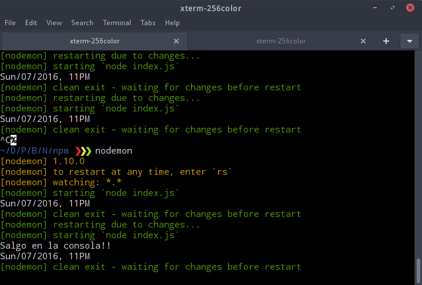

Como vemos, no fue necesario volver a correr el archivo `index.js` a mano para ver los cambios, Nodemon hizo todo el trabajo por nosotros!

## Actualizar paquetes

Como dijimos, `npm` también nos sirve para mantener actualizados los paquetes. Para hacerlo sólo tenemos que escribir el siguiente comando:

`npm update`

Para mantener la compatibilidad con las aplicaciones, `npm` sólo actualiza automáticamente los _patches_ y _minor changes_ ([Semantic Versioning](http://semver.org/))de un paquete, por defecto.

De hecho, el **^** antes del número de versión en 'dependencies' indica qué puede actualizar los _minors_ automáticamente, si quisieramos restringir ese comportamiento para que actualize sólo los _patches_ deberíamos usar el carácter **~** antes de la versión: 

```javascript
"dependencies": {
    "moment": "^2.14.1" //Actualiza sólo Minors
  }

"dependencies": {
    "moment": "~2.14.1" //Actualiza sólo Patches
  }
```

### Streams, Buffers y Pipes

Otro concepto importante para entender como funciona Nodejs ( o cualquier pieza de software en general ) es el de Streams, Buffers y Pipes. Ahora veremos que son cada uno y como se usan.

* __Buffer__: Un espacio limitado en tamaño cuyo objetivo es guardar datos de forma temporal mientras estos datos son movidos de un lugar a otro. Generalmento estos datos provienen de lo que se conoce como un _Stream_ de datos.

* __Stream__: Un stream es una secuencia de datos que se hace disponible a medida que pasa el tiempo. O sea, son pedazos de datos que van llegando de a poco, y que forman parte de algo más grande. Por ejemplo, cuando hacen stream de peliculas en NetFlix, pueden ir viendola a medida que van llegando los datos, en contraposicion con tener que bajar toda la pelicula entera antes de poder verla ( Torrents anyone? ).


En la mayoría de los casos estos dos conceptos se utilizan juntos: un __Stream__ de datos llena un __Buffer__, cuando este esta lleno, los datos se pasan para que sean procesados. ¿Vieron en YouTube cuando se traba el video y les dicen: __BUFFERING__?? Bueno, lo que está ocurriendo es que el Stream de datos (El video) se está bajando lento, entonces el reproductor no puede seguir reproduciendolo, por lo tanto tiene que esperar que el _buffer_ se llene nuevamente para poder procesar la siguiente imagen que mostrará. 

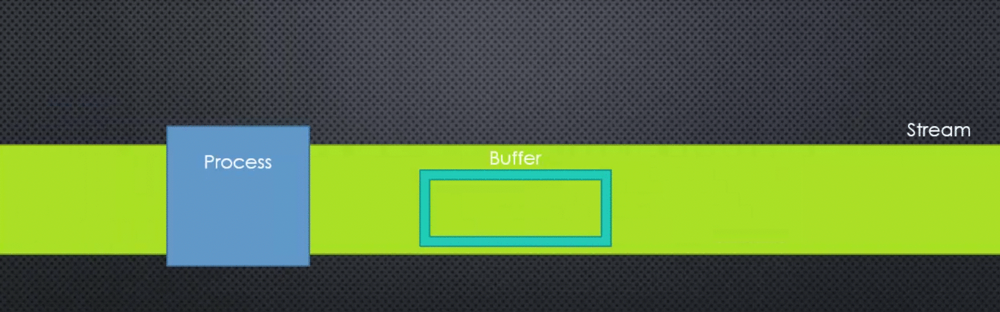

### Leyendo un archivo con Node

Para trabajar con archivos en Node, vamos a usar el módulo `fs` que tiene la funcionalidad para leer y escribir archivos, como se encuentra en las librerías core de node, vamos a requerirlo usando `require('fs')`.

Ahora vamos a crear un archivo llamado `greet.txt` y vamos a escribir un saludo dentro, lo vamos a dejar en la misma carpeta que nuestro archivo `.js`.

Ahora vamos a leer el contenido de ese archivo y mostrarlo por consola:

```javascript
var fs = require('fs');

var saludo = fs.readFileSync(__dirname + '/greet.txt', 'utf8');
console.log(saludo);
```

Como podemos ver en la [documentación](https://nodejs.org/dist/latest-v6.x/docs/api/fs.html#fs_fs_readfilesync_file_options) de `fs`, la función `readFileSync`, recibe un path como parametro y el encoding del file. 

>__\_\_dirname: esta variable tiene guardado el path completo del directorio donde está el archivo que está ejecutando el código__

Por lo tanto le estamos diciendo que lea el archivo  greet que creamos _DE MANERA SINCRONICA_ (esto quiere decir que no va avanzar hasta que no lea de manera completa) y que guarde el resultado en la variable `saludo`, luego que muestre el contenido de saludo por consola. Como vemos, el resultado es que en `saludo` se guarda el contenido del archivo `greet.txt`!!

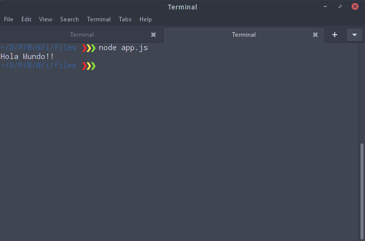

Al hacerlo sincronico, el programa se _bloquea_ hasta que no termine de leer el archivo completo, si el archivo fuera muy grande, veriamos que el programa queda _trabado_ y causa una mala experiencia de uso.

Para resolver ese problema, vamos a hacer lo mismo, pero haciendo que la lectura del archivo sea en forma asincrónica.
Para hacerlo, `fs` nos da la función `readFile`, que recibe el path del archivo a leer, el encoding, y además recibe una función, que será el `callback` para cuando se termine de leer el archivo:

```javascript
var fs = require('fs');
fs.readFile(__dirname + '/greet.txt', 'utf8', function(err, data) {
	console.log(data);
});
console.log('Listo!');
```

Hemos agregado al final el `console.log('Listo!')` para que vean en qué momento se ejecuta esa linea de código y en qué momento se ejecuta el callback.

__Es super importante que comprendan el porqué del orden en el que aparecen los console.logs, no avances antes de comprenderlo. Pista: Mirá más arriba como funciona el event loop de JS.__

Otra cosa a notar es que la función anónima que le pasamos tiene dos parámetros: _err_ y _data_. Esto se debe a que existe un standart llamado __error-first callback__ que dice que cada vez que escribas una función que ejecute un callback, le pases a ese _cb_ como __primer__ parámetro una variable de _Error_. En el caso que no haya habido errores en la ejecución, entonces esa variable tendrá _null_, en caso contrario tendrá algo que informe el error.

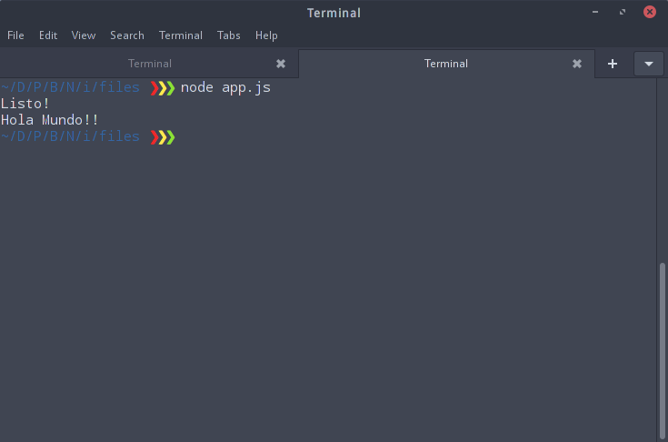

Como vemos, primero se ejecutó el segundo console log, luego el console log del _callback_. 

### Trabajando con Streams

Ya vimos el concepto de Streams, pero veamos como podemos manejarlos con Node.
De nuevo, en los módulos core hay uno que nos permite trabajar con `streams` podemos ver la documentación [aquí](https://nodejs.org/dist/latest-v6.x/docs/api/stream.html#stream_stream).

Vamos a crear un archivo llamado `greet.txt` que contenga texto, nos tenemos que asegurar que sea mucho texto asi podamos observar mejor los resultados. Yo busqué un generador de texto, como [este](http://www.lipsum.com/), y generé exactamente 20000 bytes de texto sin sentido!

Ahora lo primero que vamos a hacer es crear un _lecto de Stream_, lo hacemos usando la función `createReadStream`, que recibe por parámetros el path del archivo a leer, y un objeto de [opciones](https://nodejs.org/dist/latest-v6.x/docs/api/fs.html#fs_fs_createreadstream_path_options). En este caso le pasamos como opciones el encoding y highWaterMark.

__highWaterMark__: Es el número de bytes ( 1 byte = 8 bits) que queremos que tenga el buffer del lector de Streams.

```javascript
var fs = require('fs');

var readable = fs.createReadStream(__dirname + '/greet.txt', 
   {encoding: 'utf8', highWaterMark: 1 * 1024 }
);

readable.on('data', function(chunk) {
	console.log(chunk);
	console.log('========================================');
});
```
Una vez definido el reader de Stream, vamos a usarlo para leer el archivo y mostrar lo que va leyendo por consola.
El reader lo que hace es empezar a leer, en este caso, el archivo (podría leer datos llegando de internet tambien, por ejemplo) y va llenado un buffer, cuando se llena (se alcanza el tamaño definido en `highWaterMark`) o cuando no tiene más que leer (si el archivo fuera más chico que el `highWaterMark`) entonces el reader _emite_ un evento. Por lo tanto, lo que vamos a hacer es capturar ese evento, llamado `data` y vamos a mostrar el contenido que haya tenido el buffer en ese momento, para poder diferenciar en la salida lo que corresponde a cada buffer, hemos hecho el console log de una línea horizontal. Veamos el resultado:

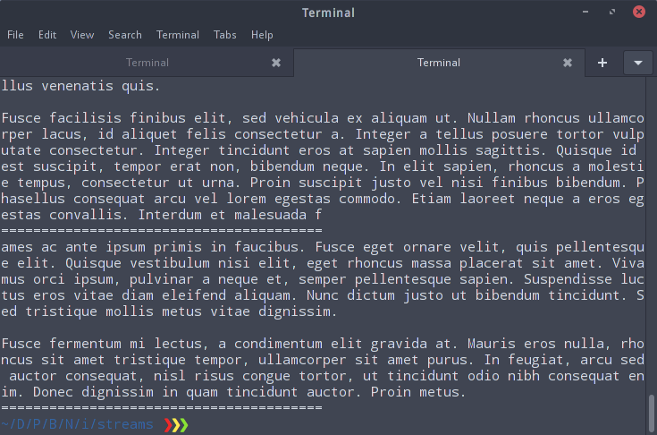

Como vemos, se fue llenando el buffer y emitiendo el evento _'on'_ y cada vez que ocurría eso se imprimia en pantalla el contenido del archivo, y la línea separadora.

__Prueben achicar o agrandar el `highWaterMark` para que vean en donde empiezan a aparecer las ĺíneas.__

Ahora para probar un Stream que sea `writer` vamos a tomar los pedazos de datos que vaya leyendo el `reader` y usandolos para escribirlos en un archivo. Para eso vamos a crear un archivo vació llamado `greetcopy.txt` en el mismo folder que los demás.

```javascript
var writable = fs.createWriteStream(__dirname + '/greetcopy.txt');

readable.on('data', function(chunk) {
	console.log('========================================');
	writable.write(chunk);
});
```
Ahora vamos a crear un Stream de tipo write usando la función `createWriteStream` y le pasamos por parámetro el archivo nuevo que hemos creado. 
Ahora, cada vez el que reader termine de leer un _chunk_ ( o sea llenar su buffer ), queremos que se escriba esos datos en el nuevo archivo: para eso usamos la función `write` del objeto `writable` que recibe por parámetro los datos a escribir.

Veamos el output de correr este código:

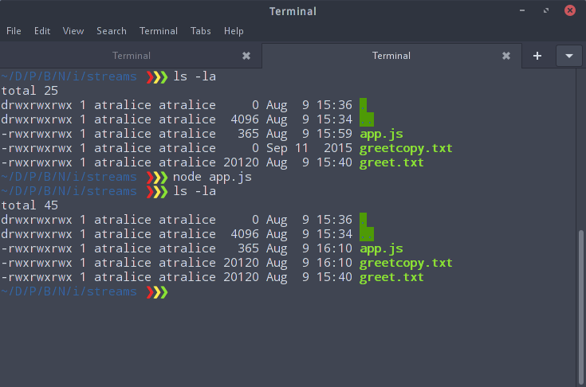

Veamos el tamaño de los archivos _antes_ de ejecutar el código: `greet.txt` tiene 20120 bytes, y `greetcopy.txt` tiene 0 bytes. Luego ejecutamos `app.js` y veamos que ahora los dos archivos tienen el mismo tamaño! o sea que nuestro copiador funcionó!


### Pipes

Un Pipe se crea cuando conectamos un Stream que lee a uno que escribe. Básicamente los _Pipes_ nos van a servir para conectar Streams, y así poder mandar información de un lugar a otro, sería como _conectar_ fuentes y destinos de información.

En Nodejs los Streams _readables_ cuentan con la función `pipe`, como pueden ver en la [documentación](https://nodejs.org/dist/latest-v6.x/docs/api/stream.html#stream_readable_pipe_destination_options). Esta función recibe como parámetro una destination ( un Stream _writable_ ) y una serie de opciones, y retorna una referencia al Stream destination (el que le pasamos), de tal manera que podemos encadenar Streams.
Para ver este concepto, haremos lo siguiente: Vamos a leer un archivo de texto con un _readable_ y primero vamos a copiarlo en otro archivo nuevo, igual que antes pero ahora con pipes. Luego vamos a agarrar de nuevo ese primer archivo, vamos a pasarlo por un proceso de compresión (usando `zlib`) y el resultado de la compresión lo vamos a escribir en nuevo archivo, esto lo vamos a lograr encadenando pipes:

```javascript
var fs = require('fs');
var zlib = require('zlib');

var readable = fs.createReadStream(__dirname + '/greet.txt');

var writable = fs.createWriteStream(__dirname + '/greetcopy.txt');

var compressed = fs.createWriteStream(__dirname + '/greet.txt.gz');

var gzip = zlib.createGzip();

readable.pipe(writable);

readable.pipe(gzip).pipe(compressed);
```

Como vemos al principio requerimos `fs` y `zlib`, este último también es parte de las librerías core de nodejs, si leemos su [documentación](https://nodejs.org/dist/latest-v6.x/docs/api/zlib.html#zlib_zlib) vemos que lo que hace, básicamente, es leer un stream de datos, comprimir su contenido y luego enviar un stream de salida con los datos comprimidos.

__Notese que el Stream creado por `zlib` es de tipo _duplex_ o sea que puede usarse para leer o escribir, justamente por eso lo podemos usar como conector de nuestro Pipe__

Para copiar el texto de el primer archivo al segundo simplemente _'conectamos'_ el stream __readable__ (que lee el archivo) con el __writable__ (que lo escribe), esto lo hacemos usando la función `pipe` en _readable_, y pasandole como destination a _writable_.

Ahora vamos a crear un stream _duplex_ llamado `gzip` que implementa un algoritmo de compresión que tiene el mismo nombre. Ese stream va a recibir datos y los va a devolver comprimidos, siempre en chunks.

Ahora para comprimir el contenido antes de guardarlo, vamos a _'conectar'_ readable (que es un stream readable) con `gzip`, y la salida de eso con _compress_ (que es un stream writable). Para hacer esta _'conexion'_ hacemos: `readable.pipe(gzip).pipe(compressed)`. Básicamento estamos pasando la salida de readable a gzip, que comprime lo que le llegué y da como salida un stream de datos comprimidos, entonces vamos a agarrar esos datos comprimidos y escribirlos en un archivo usando un nuevo stream writable. Veamos el resultado de ejecutar nuestro script:

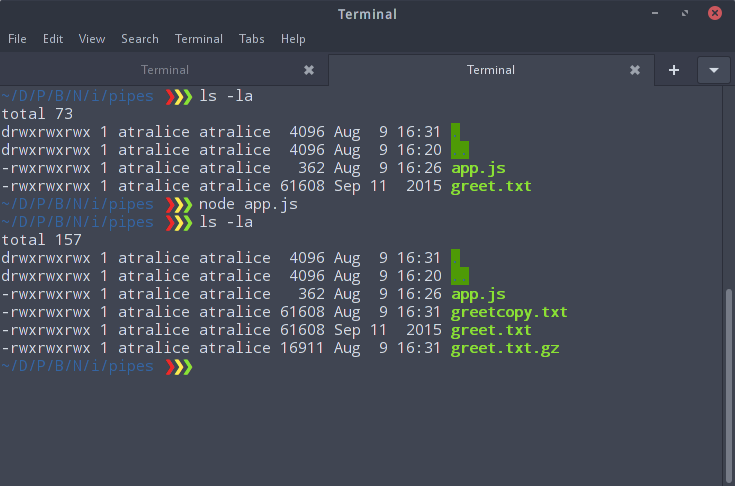

Excelente! Vemos que `greetcopy.txt` pesa lo mismo que `greet.txt` y que la versión comprimida (`greet.txt.gz`) ocupa menos! Pueden abrir los archivos y comprobar que el contenido es el mismo tambien!


### Combinando Todo

Bien! Ahora estamos listos para empezar a crear nuestro propio servidor web usando estos conceptos!