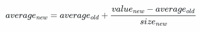

# Ejercicios Stream

## Running average

Vamos a crear un `Stream` que genera números enteros aleatorios. Y luego crear una función que lea ese `Stream` continuamente y vaya calculando el promedio de los números que van apareciendo.

La función del primer `Stream`, la que genera números deberá poder tomar por parámetro el rango de valores que podrán tomar los números aleatorios.

El output deberá ser algo del estilo:

```
2  
1  
1  
1.25  
2.8  
4.2  
4.2  
4.4  
5.2  
5  
..
..
```

Si el Stream está bien, el promedio debería converger a un valor cercano a `(max-min)/2`.

Una forma de hacerlo es crear dos Streams, uno Readable: numberGenerator y otro tipo Transform (duplex): runningAverage.
El primero genera los números aleatorios, y el segundo toma el valor del número y recalcula el promedio.
Finalmente, crear un pipe entre el primer Stream y el segundo, y por último al `process.stdout` para ver el output en pantalla.

> Para calcular el promedio, teniendo el promedio viejo usar esta fórmula:
    

> Pueden usar este [cheatsheet](https://gist.github.com/joyrexus/10026630) para ayudarse.