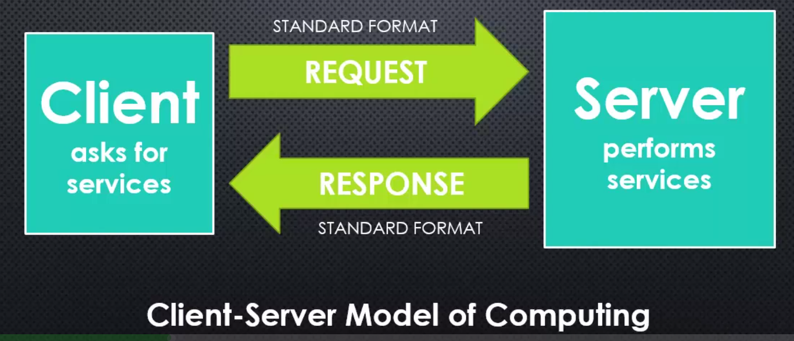
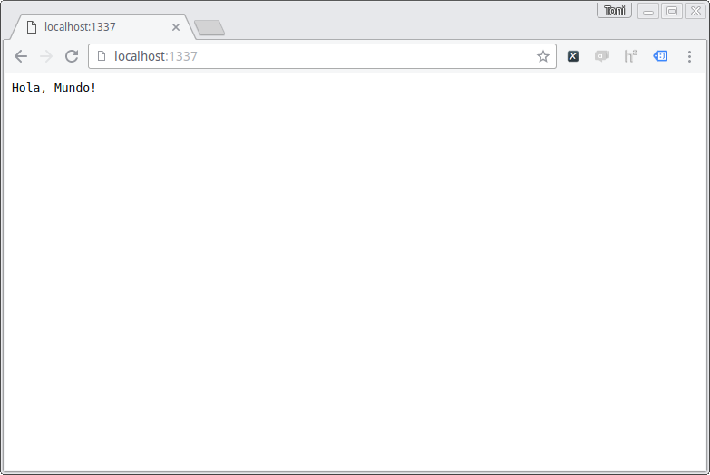
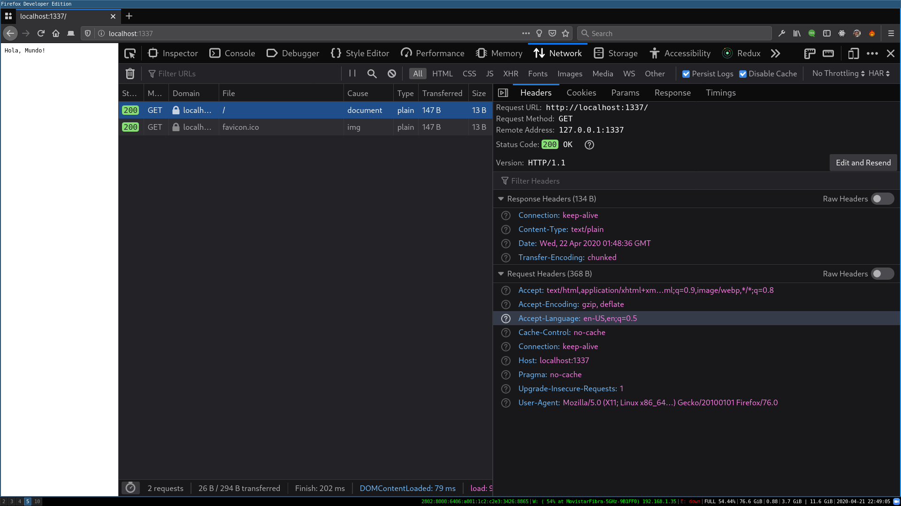
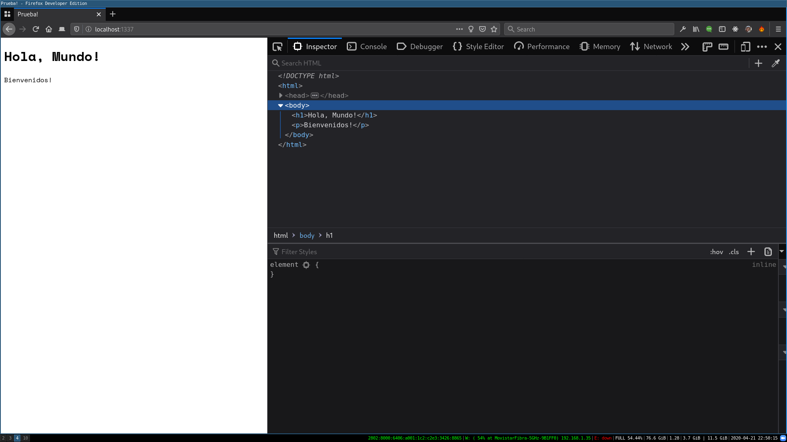
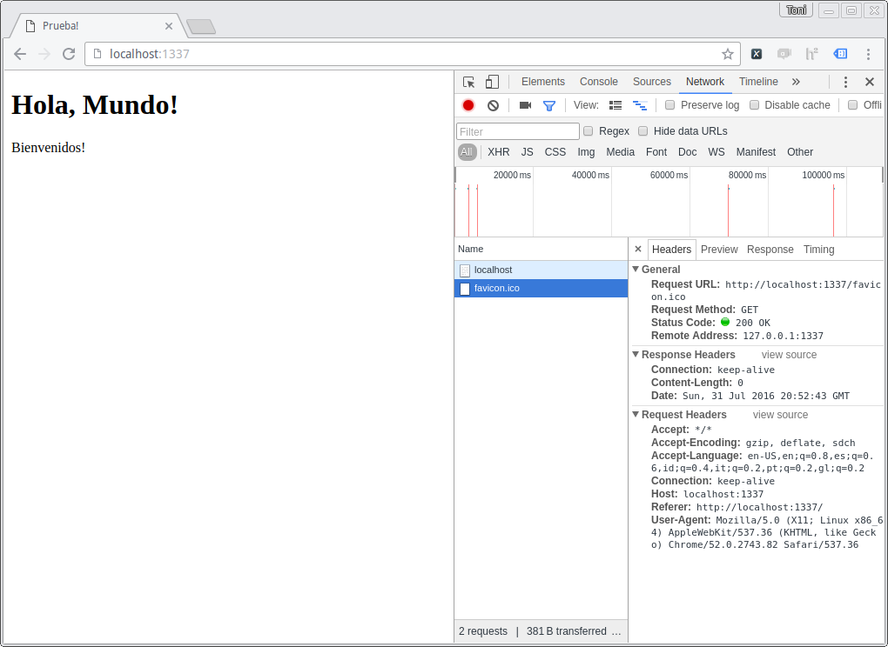

# Armando un Servidor Web con Nodejs

## Qué es un servidor web, exactamente?

Un servidor web es cualquier computadora o sistema que procese solicitudes (requests) y que devuelva una respuesta (response) a través de un protocolo de red.

### Modelo cliente servidor



Este es el modelo simplificado de cualquier consulta a un servidor web.

El cliente pide un recurso o servicio a un servidor, usando un mensaje en un formato standart (HTTP). El servidor recibe el mensaje, lo decodifica, realiza el servicio que se le pidió y devuelve el resultado en el mismo formato.

## Qué necesitamos que tenga un servidor web en Node

* Maneras de organizar nuestro código para que sea reusable
  * Nodejs Modules
* Poder leer y escribir archivos ( input/output)
  * streams y pipes
* Leer y escribir en Bases de Datos
* Poder enviar y recibir datos de internet
* Poder interpretar los formatos estándares
  * http_parser
* Alguna forma de manejar procesos que lleven mucho tiempo
  * Naturaleza asincrónica de javascript, callbacks

### Entendiendo el protocolo HTTP

Nodejs viene preparado para poder leer e interpretar el contenido de un mensaje HTTP. Lo logra con la librería [http_parser](https://github.com/nodejs/http-parser), qué es un programa hecho en C y que está embebido en Node.

Usando esta librería de C, Nodejs tiene módulos que nos ayudan a manejar de manera fácil request y reponses HTTP. 

# Empezemos a construir un server básico

```javascript
var http = require('http'); // importamos el módulo http para poder trabajar con el protocolo

http.createServer( function(req, res){ // Creamos una serie de events listener, que van a escuchar por requests que ocurren en este socket
	//Para crear un response empezamos escribiendo el header
	res.writeHead(200, { 'Content-Type':'text/plain' }) //Le ponemos el status code y algunos pair-values en el header
	res.end('Hola, Mundo!\n');


}).listen(1337, '127.0.0.1'); //Por último tenemos que especificar en que puerto y en qué dirección va a estar escuchando nuestro servidor
```

Para probar el código, corremos el código usando `node app.js`. Primero notamos que a diferencia de otro código que podamos haber corrido, este programa no termina su ejecución, esto sucede porque el servidor está hecho de manera que se quede escuchando indefinidamente por requests en el puerto y dirección especificadas.

Ahora, para ver si está funcionando como esperábamos vamos a ir al browser y en la barra de dirección escribrimos `localhost:1337`, de esta forma el browser va a ser un request al socket donde dejamos escuchando nuestro server.



Como vemos el servidor respondió con el texto que especificamos en nuestro código!

De hecho, usando las developer tools, podemos ver el request HTTP que hizo el server:




## ¿Qué más podemos hacer, ahora que tenemos un server corriendo?

### Enviando HTML

Ahora vamos a mejorar el servidor para que no sólo devuelva texto plano, sino que devuelva HTML.
Podríamos incluir el html como string dentro del código del servidor, pero eso sería engorroso de manejar.

Por lo que vamos a crear un nuevo archivo HTML muy simple llamado `index.html` al que vamos a leer con el servidor.

```html
 <!DOCTYPE html>
 <html>
 <head>
 	<title>Prueba!</title>
 </head>
 <body>
 	<h1>Hola, Mundo!</h1>
 	<p>Bienvenidos!</p>
 </body>
 </html>
 ```

Como dijimos que vamos a tener que **leer** el archivo, vamos a necesitar el módulo *fs* de nodejs.

```javascript
var fs   = require('fs');
```

Además ahora tenemos que cambiar la propiedad `Content-type` de `text/text` a `text/html` para que el browser sepa que le estamos enviando un archivo que contiene html y no sólo texto plano. *__¿Qué pasaría si no cambiaramos esta propiedad?__*

Ahora vamos a usar el método `readFileSync` de `fs` para leer el archivo `index.html` que habiamos creado y lo guardamos en una nueva variable que llamaremos `html`.

__En este caso particular usaremos el método de lectura sincrónico para no complicar el código__

Una vez leído el archivo, vamos a poder enviarlo como argumento del método `end`.

```javascript
var http = require('http');
var fs   = require('fs'); //Importamos el módulo fs que nos permite leer y escribir archivos del file system

http.createServer( function(req, res){ 
	
	res.writeHead(200, { 'Content-Type':'text/html' })
	var html = fs.readFileSync(__dirname +'/html/index.html');
	res.end(html);


}).listen(1337, '127.0.0.1');
```

Corremos el servidor con `node` y vemos el nuevo resultado:



Como vemos, cuando le llegó el request al server, este leyó el archivo html y lo envió. El browser interpretó que el contenido era `text/html` y lo renderizó como tal.


### Contenido Dinámico: **Templates**

Si quisieramos que el contenido del html no sea estático podriamos, por ejemplo, hacer que el html varie según una variable. Veamos como podemos lograr eso.

Primero vamos a crear un nuevo html al que llamaremos `template.html`. Y vamos a agregar un placeholder (en este caso particular encerramos una palabra con `{}` ), lo que haremos luego será buscar en el archivo lo que esté encerrado en `{}` y reemplazarlo por el contenido la variable que elijamos.

```html
 <!DOCTYPE html>
 <html>
 <head>
 	<title>Prueba!</title>
 </head>
 <body>
 	<h1>Hola, {nombre}!</h1>
 	<p>Bienvenidos!</p>
 </body>
 </html>
 ```
Esta idea, de tener placeholders que luego serán reemplazados por contenido que esté en una variable es conocido como **Templates**. Existen varios _lenguajes_ de templating que trabajan con este concepto. Más adelante veremos algunos de ellos.

Ahora volvamos al código del servidor. Ahora, antes de enviar el html leído del archivo lo vamos a tener que parsear, por eso vamos a tener que tratar el archivo como una `String` y no como un `Buffer`, por lo que agregaremos el argumento `'utf-8' a la función `readFileSync`, para que el buffer sea codificado a una String.

Luego, vamos a crear la variable que va a tener el texto que queremos que se reemplaze en nuestro template. Por ejemplo: `var nombre = 'Soy Henry'`.

Ahora vamos a usar el método `replace` del objeto `String`, para que cuando encuentre el placeholder antes definido ( _{nombre}_ ) lo reemplaze por el contenido de nuestra variable `nombre`.

Finalmente, enviamos lo que está en la variable `html` en el response.

```javascript
var http = require('http');
var fs   = require('fs'); //Importamos el módulo fs que nos permite leer y escribir archivos del file system

http.createServer( function(req, res){ 
	
	res.writeHead(200, { 'Content-Type':'text/html' })
	var html = fs.readFileSync(__dirname +'/html/template.html', 'utf8'); //Codificamos el buffer para que sea una String
	var nombre = 'Soy Henry'; //Esta es la variable con la que vamos a reemplazar el template
	html = html.replace('{nombre}', nombre); // Usamos el método replace es del objeto String
	res.end(html);


}).listen(1337, '127.0.0.1');
```

Si todo funcionó bien, al recibir el request el server leerá el archivo html, reemplazará el contenido de la variable dentro del placeholder que habíamos definido. Luego enviará el resultado al browser por lo que deberíamos ver lo siguente:


### Devolviendo JSON

Como sabemos, existen servidores cuyas URLS no nos devuelven un archivo HTML, si no que nos devuelven datos en formato JSON. Comunmente estos _endpoints_ son parte de un **API**.

Veamos como podríamos modificar nuestro servidor para que se comporte como lo haría un endpoint de un API.

Como vimos antes, lo primero que debemos cambiar es el header que indica el tipo de contenido que estamos devolviendo, ahora vamos a cambiar el `content-type` a `application/json`, que es el **MIME TYPE** para JSON.

Ahora, en vez de leer de un archivo, vamos a crear algo de datos. Por ejemplo, podemos crear un objeto:

```javascript
var obj = {
	nombre: 'Juan',
	apellido: 'Perez'
};
```

Antes de enviar el objeto, debemos convertir el contenido a un String con formato JSON. Para esto vamos a usar la función `stringify` del objeto `JSON`, el cuál transforma un objeto a un string con notación JSON.

El proceso de transformar un objeto a un formato que pueda ser transferido o guardado se conoce como **SERIALIZE**. En este caso transformamos un objeto que estaba en memoria en un string con formato JSON que puede ser enviado por internet. Otros ejemplo de formatos pueden ser CSV, XML, etc.
El proceso inverso (el de transformar de un formato a un objeto en memoria) se conoce como **DESERIALIZE**.

```javascript
var http = require('http');
var fs   = require('fs');

http.createServer( function(req, res){ 
	
	res.writeHead(200, { 'Content-Type':'application/json' }) //Vamos a devolver texto en formato JSON
	var obj = {
		nombre: 'Juan',
		apellido: 'Perez'
	}; //Creamos un objeto de ejemplo para enviar como response
	
	res.end( JSON.stringify(obj) ); //Antes de enviar el objeto, debemos parsearlo y transformarlo a un string JSON

}).listen(1337, '127.0.0.1');
```
De nuevo, corremos el servidor y vamos al browser a probar nuestro nuevo endpoint.


Como vemos, nuestro servidor nos devolvió correctamente el objeto que habiamos creado.

### Creando más de un Endpoint: **Routing**

Todos los ejemplos anteriores de servidores mantiene una sola ruta, es decir, que cualquier request que llegué al servidor va a ser servida de la misma forma ( _Prueben desde el browser hacer request a un path distinto, por ejemplo: `http://localhost:1337/index/` o `http://localhost:1337/hola.jpg`_). Esto se debe a que en ningún momento en nuestro código nos fijamos qué URL está pidiendo el request, simplemente le devolvemos lo mismo a cualquier request!

Ahora veremos como podemos mapear distintos requests HTML a distintos contenidos en el servidor, este proceso de mapeo es conocido como **ROUTING**.

Para hacerlo vamos a tener que examinar en cada request que llega la URL a la que quiere acceder, para eso vamos a hacer uso del objeto `req` que vive dentro de la función `createServer`. Ese objeto tiene toda la información del request que llegó, en este caso nos interesa la URL, ese dato lo encontraremos en `req.url`.

Para este ejemplo vamos a agregar dos rutas, la primera _'/'_ en la que devolveremos el html leyendo del archivo como hicimos al princio, y la segunda _'/api'_ en la que devolveremos el objeto JSON.

Como dijimos la propiedad `req.url` contiene la URL del request, por la tanto nos fijaremos en su contenido para decidir qué queremos devolver:

```javascript
var http = require('http');
var fs   = require('fs');

http.createServer( function(req, res){ 
	if( req.url === '/'){ //Si la URL es / devolvemos el HTML
		res.writeHead(200, { 'Content-Type':'text/html' })
		var html = fs.readFileSync(__dirname +'/html/index.html');
		res.end(html);
	}
	if(req.url === '/api'){ //Si la URL es /api devolvemos el objeto
		res.writeHead(200, { 'Content-Type':'application/json' })
		var obj = {
			nombre: 'Juan',
			apellido: 'Perez'
		};	
		res.end( JSON.stringify(obj) );
	} 
}).listen(1337, '127.0.0.1');
```

Ahora corramos el servidor, y probemos los distintos endpoints en el browser.

Vamos a 'localhost:1337/':



Nos devolvió el HTML, como esperabamos!

Ahora a 'localhost:1337/':


:D

__¿Qué pasa ahora con los demás endpoints, por ejemplo 'localhost:1337/hola/como/va'? Por qué el servidor se comporta de esa forma?__

### Manejando las URLs que no existen

Todos sabemos que cuando ingresamos una URL que no existe en la web terminamos obteniendo el error **404**, que es el código que define el error 'Not Found' dentro del standart HTTP.

Entonces, agreguemos a nuestro server la funcionalidad que si la URL del request no coincide con ninguna de las que habiamos ruteado que devuelva el error 404. Vamos a agregar un `else if` y luego un `else` para asegurnos que sólo se ejecute la porción de código que queremos en cada caso:

```javascript
var http = require('http');
var fs   = require('fs');

http.createServer( function(req, res){ 
	if( req.url === '/'){
		res.writeHead(200, { 'Content-Type':'text/html' })
		var html = fs.readFileSync(__dirname +'/html/index.html');
		res.end(html);
	}else if(req.url === '/api'){
		res.writeHead(200, { 'Content-Type':'application/json' })
		var obj = {
			nombre: 'Juan',
			apellido: 'Perez'
		};	
		res.end( JSON.stringify(obj) );
	} else{
		res.writeHead(404); //Ponemos el status del response a 404: Not Found
		res.end(); //No devolvemos nada más que el estado.
	}
	
}).listen(1337, '127.0.0.1');
```

Ahora, si probamos desde el browser una URL que _no existe_, por ejemplo `http://localhost:1337/hola/como/va` obtenemos el siguiente resultado:


Copado, no?

Ya pudimos armar nuestro propio servidor con algunos endpoints. Pero no les parece que si nuestro servidor tuviera muchas endpoints el código se haría muy engorroso y díficil de mantener? Por suerte hay gente que ya se topó con estos problemas y escribieron código que les ayuda a simplificar esta tarea.

# RESTful API

## API (Aplication Programming Interface)

Una API es a un software o aplicación lo que una interfaz gráfica es al manejo de una computadora, es decir, una API nos facilita la comunicación con el software. Lo hace __abstrayendo__ la implementación subyacente y mostrando solamente las acciones que son útiles para el desarrollador. De esta forma, al reducir el nivel de complejidad aparente de un software, bajan la carga de _entendimiento_ que tienen que tener los desarrolladores antes de utilizar ciertas tecnologías.

Ahora están de moda las API webs, pero existen de todo tipo y en casi todos los tipos de software:

### En Librerías y Frameworks

Cada vez que usemos una librería o un framework y vamos a su documentación es muy probable que nos encontremos un link a su API (si la librería o framework está bien documentado). En ella vamos a encontrar la descripción, la forma de usar y el comportamiento esperado de las tareas que realiza esa librería. 
Según el tipo de lenguaje que usemos, la documentación de las API puede variar, por ejemplo: para lenguajes de scripting como `Lua` las api pueden consistir en describir funciones y rutinas con fines específicos, pero en lenguajes orientas a objetos como `java`, la api puede describir una serie de _clases_ y sus respectivos _métodos_.

### Sistemas Operativos

Un API tambien puede especificar la interfaz entre una aplicación y el sistema operativo. De hecho, puede servir para mantener compatibilidad hacia atrás, ya que podemos espcificar distintas versiónes del API y mantener varias implementaciones. Por ejemplo, Microsoft Windows mantiene API de compatibilidad para ejecutar programas viejos sobre los nuevos sistemas operativos Windows, le llaman _Modo de Compatibilidad_.

### Apis Remotas

Una API remota les permite a los desarrolladores manipular recursos remotos a traves de un _protocolo_ (no necesariamente HTTP). Por ejemplo, existen API que nos dejan hacer queries a distintos tipos de bases de datos que en general se encuentran en hosts remotos.

### Web APIS

Cuando la usamos en la web, van a estar montadas sobre el protocolo `http`, por lo tanto podríamos decir que una API web es un set de tipos de mensajes HTTPs posibles, junto con la descripción el formato de la eventual respuesta de esos mensajes ( en general la respuesta es en JSON o XML ). Históricamente el término Web api es similar a _web services_. La forma de implementar y de usar estos web services fue cambiando de paradigma, actualmente se usa el diseño tipo REST, y en general en una web se consumen más de un API y se combinan sus resultados en una sóla página. 

#### Endpoints

Un endpoint en un web api especifica donde están los recursos que pueden ser accedidos desde afuera de la API. Por ejemplo: `https://api.punkapi.com/v2/beers` especifica un endpoint de la API de `Punk Api`.

> Noten que esta API tiene la versión, por lo tanto ofrece compatibilidad hacia atrás.

## REST

Rest es una estilo arquitectura o forma de diseñar el backend de una aplicación que viva en internet. REST viene de "REpresentational State Transfer" y está basado fuertemente en cómo trabaja HTTP, que es el protocolo que usamos comunmente en la web. 

Como sabemos, HTTP es un protocolo basado en el modelo cliente servidor, quienes intercambian mensajes basados en ciertas acciones. Por ejemplo, un mensaje HTTP tipo GET realizado a la URL `http://example.com/`.

está basado en recursos y no en acciones.

Vamos a ver

# Concepto


# Características

## Cliente - Servidor

La arquitectura REST utiliza los conceptos del modelo cliente servidor en el sentido de separar las inquietudes de la interfaz de usuario con las inquietudes del manejo y guardado de datos. Esto ayuda a que cada componente pueda evolucionar de manera separada, acomodanse a como cambian hoy en día las interfaces en internet.

## Stateless

La comunicación entre el cliente y el servidor se logra sin que el servidor tenga guardado ningún contexto del cliente entre requests. Cada request del cliente contiene toda la información necesaria para que el servidor pueda contestar correctamente al request. 

## Cacheable

En esta arquitectura, cada recurso tiene que estar marcado como cacheable o no. En el primer caso para ayudar al servidor a realizar menos trabajo y aumentar la performance y en el segundo para que no lleguen al cliente recursos con datos inapropiados. 

## Sistema de capas

Un cliente no debería ser capaz de distinguir si se está conectado directamente con le servidor, o está pasando por un intermediario antes de llegar a él. Estos servidores intermediarios pueden ayudar a aumentar la performance implementando servicios de load-balancing, shared caches, etc...

## Interface Uniforme

El diseño de una interfaz uniforme es fundamental para la arquitectura, hacerlo bien simplifica mucho la arquitectura y la hace modular, logrando asi que pueda evolucionar o escalar para parte por separado. Las características que deben tener las interfaces uniformes son:

* __Identificación de recursos__: Cada recurso tiene que ser identificado en el request, por ejemplo a través de un _URI_. El recurse per se también está separado de su representación, la que es enviada al cliente; esta puede ser, por ejemplo, el mismo recurso representado en: JSON, XML, HTML, etc...
* __Manipulación de recursos a través de representaciones__: Cuando un cliente tiene la _representación_ de un recursos, deberá tener la suficiente información para _modificar_ o _eliminar_ ese __recurso__.
* __Mensajes descriptivos__: Cada mensaje deberá contener suficiente información para describir cómo procesar el mensaje. En una API web, esto se traduce a mapear rutas con los verbos _HTTP_.
* __Hypermedia as the engine of application state(HATEOAS_)__: Un cliente REST debería ser capaz de _navegar_ y _descubrir_ todas las acciones posibles de hacer a un recurso luego de interactuar con él. Es similar a cuando entramos a una web desde una _URL_ y la web misma nos provee los _links_ para que sigamos navegando. En la arquitectura REST debería ocurrir lo mismo, cada respuesta debería contener _links_  o información a las siguientes acciones que se pueden tomar.

## Otras Arquitecturas

REST no es la única forma de diseñar tu API, existen otras. Cada una será mejor o peor según el problema a resolver y un poco por el gusto del programador. Veamos algunas que están pisando fuerte pero todavía no son las más usadas:

* __[JSON API](http://jsonapi.org/)__: Es una especificación, al igual que REST. Está pensada para minimizar el número de requests y la cantidad de datos que se transmiten por la red. 
* __[GraphQL](http://graphql.org/)__: Es en realidad una librería que ofrece un nuevo __lenguaje__ para hacer consultas a nuestra API. Cambia un poco el concepto de endpoints, y los embebe en esta nueva forma de hacer queries. Todavía es nuevo, pero está tomando tracción rápidamente.