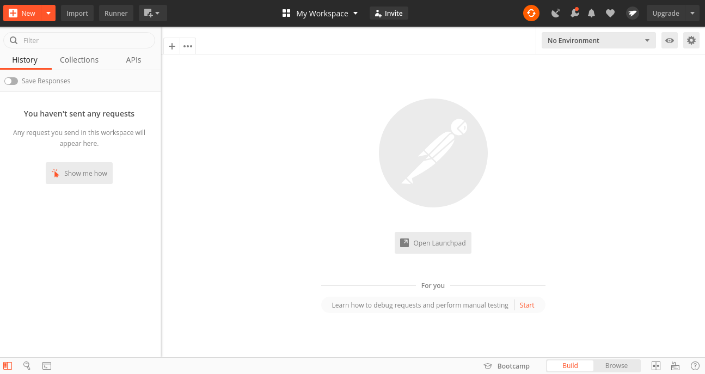
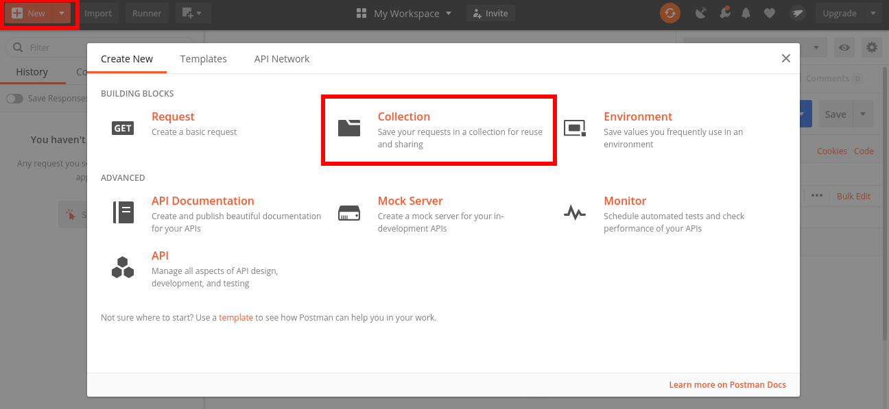
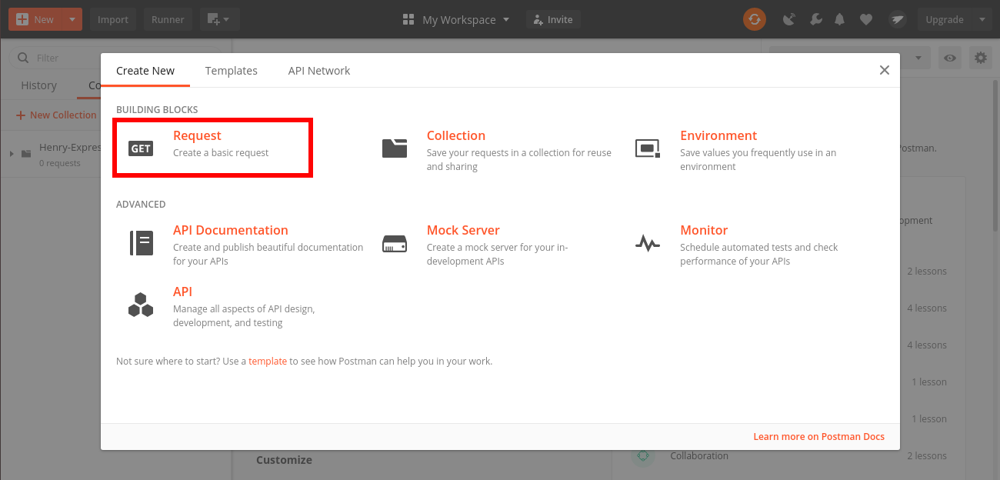
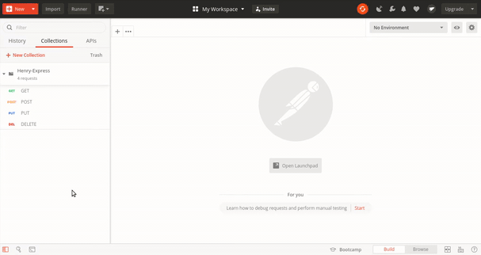

# Express Posts Homework

## Descripción

En esta homework vamos a desarrollar una API que nos permitirá gestionar Posts (entendiendo como tal a una publicación similar a las que hacemos en las redes sociales) y realizar las siguientes acciones:

* Consultar Posts existentes
* Crear nuevos Posts
* Actualizar Posts existentes
* Eliminar Posts existentes

Por lo que estaríamos construyendo algo similar a lo que sería un gestor de publicaciones de cualquiera de las redes sociales que conocemos

## Configuración inicial

1. Ejecutar `npm install` desde la carpeta "homework"
2. Ejecutar `npm test` para correr los tests
3. Ejecutar `npm run nodemon` para que el servidor quede corriendo en nuestra computadora y automáticamente se restartee si realizamos algún cambio
4. Ya se encuentra todo configurado, podremos hacer requests a `http://localhost:3000` que es donde estará corriendo nuestro servidor. (Para ver cómo realizar request ver el apartado `Postman` al final de este documento)

## Instrucciones

Como se mencionó anteriormente debemos generar una API para gestionar Posts, los mismos serán almacenados en memoria utilizando un array de JavaScript denominado `posts` para evitar tener que trabajar con una base de datos.

Cada `Post` va a ser un objeto con la siguiente estructura:

```js
{
  title: "Titulo del Post",
  contents: "Contenido del Post"
}
```
Tanto `title` como `contents` van a ser del tipo String.

Desarrollar las siguientes cinco rutas dentro del archivo `server.js` de la carpeta `src`

### Breve repaso de creación de rutas

Básicamente, la creación de rutas sirve para determinar cómo una aplicación responde a la solicitud de un cliente en un determinada vía de acceso (llamada URI) con un método de solicitud HTTP específico. En otras palabras, lo que vamos a hacer es invocar uno de estos métodos HTTP (especialmente POST, GET, PUT, HEAD y DELETE), utilizando la variable app, para indicarle la acción que queremos realizar y disponer la ruta que queremos para una determinada URI. 

Es por esto que la definición de creación de rutas es la siguiente:

```javascript
server.METHOD(PATH, HANDLER)
```

Donde: 

  - server es una instancia de express
  - METHOD es un método de solicitud HTTP
  - PATH es la vía de acceso al servidor
  - HANDLER es la función que se ejecuta cuando se hace el direccionamiento a la ruta, siempre recibe como parámetro dos variables, req por request y res por response.

Veamos ahora un ejemplo más concreto. El método GET se utiliza para leer la representación de un resource, que puede estar en distintos formatos tales como una imagen, un JSON, un XML, etc. Por lo que utilizando nuestra instancia de express vamos a invocar a get indicando la ruta que queremos para `'/'` y mandar una response con un "Hola mundo!" como texto.

```javascript
server.get('/', function(req, res){ //Ruta para un GET a /
  res.send('Hola mundo!'); // response "Hola mundo!" en la pagina principal
});
```

Si en lugar de texto queremos que se envíe con el formato JSON podríamos hacer lo siguiente:

```javascript
server.get('/', function(req, res){
  var obj = {
    saludo: 'Hola mundo!'
  }
  res.json( obj );
});
```

Ahora supongamos que queremos setear el status de la response como 200 para indicar que la solicitud ha tenido éxito, para eso utilizaremos `res.status()`.

```javascript
server.get('/', function(req, res){
  res.status(200).send('Hola mundo!');
});
```

Otro punto a tener en cuenta es que `req.body` se usa para tener los parámetros que son enviados por el cliente como parte de un request. Entonces, si por ejemplo quisiera acceder a la propiedad name podria utilizar `req.body.name`.

```javascript
server.get('/', function(req, res){
   var obj = {
    saludo: 'Hola' + req.body.name,
  }
  res.json( obj );
});
```

Para finalizar si queremos acceder a los parámetros de una consulta utilizaremos `req.query`. Por ejemplo, supongamos que se desea buscar 'toni' realizando un `GET /search?name=toni`, entonces lo que haremos será acceder al parámetro nombre de la query con `req.query.name`.

### `POST /posts`

Cuando se ejecute un request del tipo `POST` en la ruta `/posts`:

- Asegurarse que dentro del body del request existan tanto `title` como `contents`. En el caso de que alguno de ellos no se encuentre, devolver un JSON con un objeto de la forma `{error: "No se recibieron los parámetros necesarios para crear el Post"}`. Verificar que el código de error sea el adecuado.

- Si ambos cambos fueron provistos, crear un nuevo objeto Post con los valores indicados para `title` y `contents` y asignándole un valor numérico único como propiedad `id`. Agregar dicho objeto al array de posts. Devolver un JSON con el objeto recientemente creado.

### `GET /posts`

Cuando se ejecute un request del tipo `GET` en la ruta `/posts`:

- Si existe el parámetro `term` dentro de la URL (query-string parameter) devolver aquellos Posts que contengan el valor del parámetro `term` en su título o en su contenido (o en ambos).

- Caso contrario, devolver todos los Posts que se encuentren almacenados en el array `posts`.

### `PUT /posts`

Cuando se ejecute un request del tipo `PUT` en la ruta `/posts`

- Asegurarse que dentro del body del request existan `id`, `title` y `contents`. En el caso de que alguno de ellos no se encuentre, devolver un JSON con un objeto de la forma `{error: "No se recibieron los parámetros necesarios para modificar el Post"}`. Verificar que el código de error sea el adecuado.

- En el caso de que el `id` no corresponda a un post válido existente, devolver un JSON similar al anterior modificando el mensaje de error por uno adecuado para este caso.

- Si se encuentran todos los parámetros y el `id` es válido, actualizar los datos del `title` y `contents` del Post que coincida con dicho `id` . Devolver un JSON con el objeto recientemente actualizado.

### `DELETE /posts`

Cuando se ejecute un request del tipo `DELETE` en la ruta `posts`

- Asegurarse que dentro del body del request exista un `id` correspondiente a un Post válido. De no ser así, ya sea por falta del campo `id` o por ser un id inválido, devolver un JSON con un objeto con un mensaje correspondiente en cada caso manteniendo la forma de siempre: `{error: "Mensaje de error"}`

- En el caso de que el `id` corresponda a un Post válido, eliminarlo del array de Posts y devolver un JSON con el siguiente objeto: `{ success: true }`.

## Postman

### Instalación

Pueden descargar Postman para el sistema operativo que tengan desde aca: https://www.postman.com/downloads/

### Instrucciones

Una vez instalado podrán acceder a la siguiente pantalla principal de Postman:

<p align="center">
  
</p>

1. Crear una nueva `Collection` para agrupar allí todos los request que vayamos a hacer para este proyecto. Para eso clickear en el botón `New`, luego seleccionar `Collection` y darle un nombre a la misma.

<p align="center">
  
</p>

2. Crear un nuevo `Request`, darle un nombre y seleccionar la colección creada anteriormente para agrupar todos los Request allí

<p align="center">
  
</p>

3. Ahora en la parte del recuadro rojo tendremos que

- Indicar que tipo de Request queremos:

    * GET
    * POST
    * PUT
    * DELETE

- La URL sobre la cual vamos a realizar el request (En este caso será http://localhost:3000/)

- Incluir los `Params` o el `Body` dependiendo del tipo de Request que hagamos

  <p align="center">
    
  </p>

Video demostrativo de cómo se utiliza y funcionan algunos request básicos de Postman:

  <p align="center">
    
  </p>
