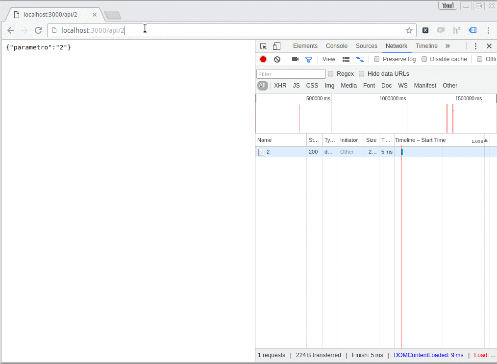
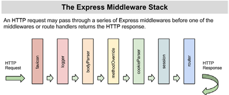
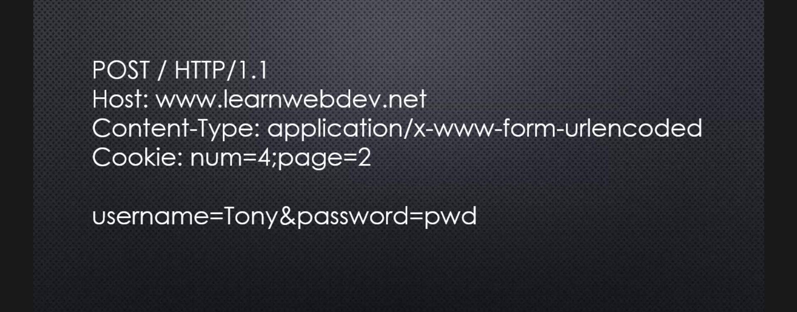
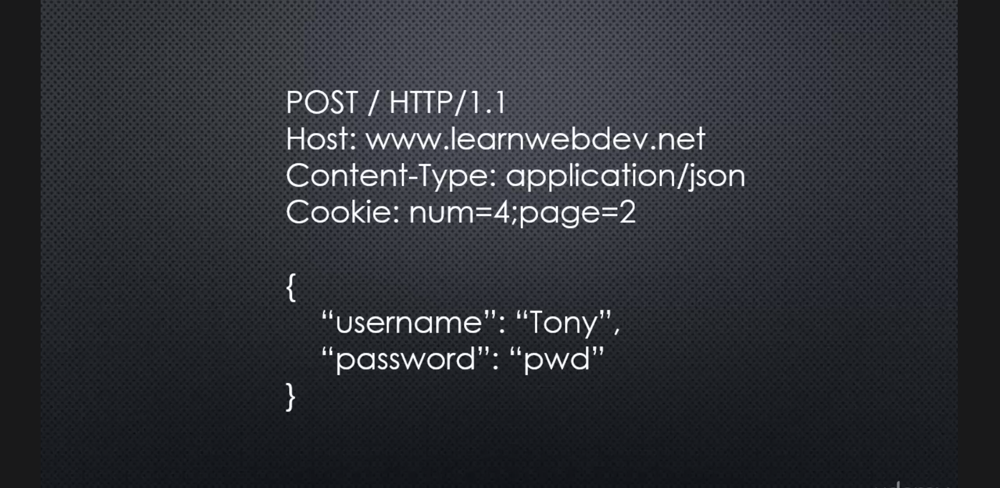
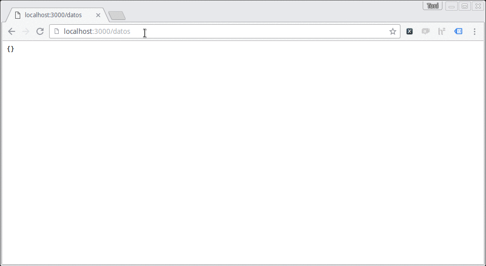
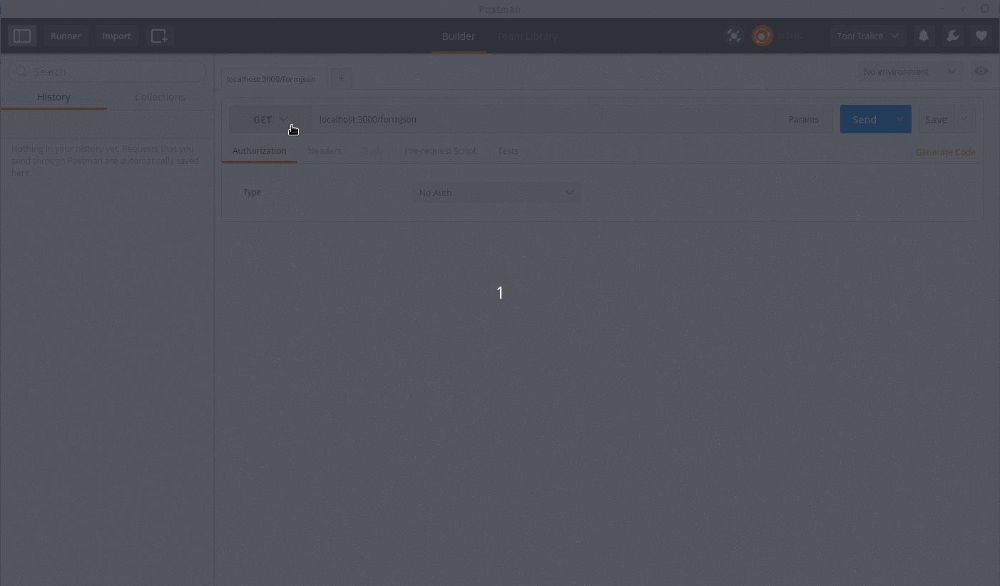

# Express

_Express.js_  o simplemente _Express_ es un framework diseñado para crear aplicaciones web y APIS. Está bajo la licencia [MIT](https://en.wikipedia.org/wiki/MIT_License), y es, tal vez, el framework web más usado en el ecosistema de Nodejs.

## Instalación

Vamos a iniciar una app nueva con `npm init` a la que vamos a llamar _expresstest_ y luego vamos a instalar express usando `npm`:

`npm install express --save` _--save  para que se guarde en package.json_

Ahora vamos a crear un archivo `index.js` _( o  con el nombre que hayan definido como entry point)_ y vamos a requerir 'express'.

```javascript
var express = require('express');
```

Cuando requerimos express, lo que nos devuelve la librería es una función, que envuelve toda la funcionalidad de express. Por eso, para inicializar una nueva applicación, vamos a crear una variable (comúnmente llamada `app`) y guardar en ella la ejecución de express.

```javascript
var express = require('express');
var app 	= express();	
```

Dentro de nuestra nueva variable app, vamos a tener varias funciones. Una de ella es `listen()`, que tiene envuelto adentro a la función `http.createServer()` que habíamos usado para crear nuestro propio webserver. Ahora en vez de llamar esa función directamente llamamos a `listen()` y le pasamos un puerto. 

```javascript
app.listen(3000);
```

Noten, que todo lo que hace express, lo pueden hacer ustedes también escribiendo el código, sólo es un montón de código preescrito que resuelve problemas muy comunes de una manera muy buena, justamente por eso es que es tan popular.

## Creando rutas

Ahora la variable `app` tiene asociado varios métodos que mapean a [métodos HTTP](https://en.wikipedia.org/wiki/Hypertext_Transfer_Protocol#Request_methods), también llamados 'verbos Http'. Con esto especificamos qué queremos que haga el servidor según el tipo de método http del request y la URL.

Agreguemos una ruta para `'/'` con el método GET. (_El método GET es el que hace el broswer por defecto cuando escribimos algo en la barra de direcciones_):

```javascript
app.get('/', function(req, res){ //Ruta para un GET a /

});
```
Como vemos, esto reemplaza la serie de `if`s que habiamos escrito para nuestro webserver antes. Además nos agrega la discriminación del método HTTP. Estos métodos reciben como parámetro un callback, el cual correran cuando llegue un request de este tipo al URL definido ( `/` en nuestro ejemplo). Noten que ese callback tiene siempre como parámetro dos variables, `req` por __request__ y `res` por __response__, que envuelven los objetos `http.request` y `http.response` respectivamente, agregándole más funcionalidad.

```javascript
app.get('/', function(req, res){
	res.send('Hola');
});
```

Como ejemplo, vamos a usar `res.send()` para enviar texto como respuesta. No fué necesario explicitar el `Content-type`, ya que _express_ se encarga de eso por nosotros tambien!


Podemos ejecutar el server con `nodemon` y probar la URL `'/'` en el browser.

Agreguemos una nueva ruta `/api` y retornemos un objeto JSON. Para esto, express viene preparado con la función `json()` que recibe un objeto y lo pasa como response. Noten que no tuvimos que _Serializar_ el objeto! De esta forma _express_ nos ahorra mucho tiempo.

```javascript
app.get('/api', function(req, res){
	var obj = {
		nombre: 'prueba',
		framework: 'express',
		ventaja: 'serializó por nosotros'
	}
	res.json( obj );
});
```

Probemos el nuevo _endpoint_ en el browser:


Veamos que más podemos hacer con _express_!

## Routing

Express nos ofrece muchísimas soluciones para varios problemas, es por eso que vamos a tener que aprender a leer y buscar en la documentación (que por cierto es muy buena) de _express_.

Veamos la documentación sobre [routing](https://expressjs.com/en/guide/routing.html).

Como vemos, hay varias formas de hacer las rutas usando las URL: Podemos hacerlo con un nombre fijo como veniamos haciendo o de hecho también podemos usar `strings patterns` y `regular expressions` tal que matcheen múltiples rutas, por ejemplo:

### Basadas en String Patterns

Esta ruta matcheará _acd_ y _abcd_:

```javascript
app.get('/ab?cd', function(req, res) {
  res.send('ab?cd');
});
```
Esta ruta matcheará _abcd_, _abbcd_, _abbbcd_, y así sucesivamente:

```javascript
app.get('/ab*cd', function(req, res) {
  res.send('ab*cd');
});
```

### Pasando parámetros en las rutas

Veamos como nos ayuda _express_ a capturar parámetros embebidos en la URL.

Veamos el siguiente ejemplo:
```javascript
app.get('/api/:id', function(req, res) {
	res.json( { parametro: req.params.id } );
});
```
A la ruta `/api` le hemos agregado `/:id`, ahora _express_ va a parsear esa ruta, y va a tomar como parámetro lo que esté después de la primera `/` y lo vamos a poder acceder a través del nombre `id`. Por ejemplo en `/api/2` id va a tomar el valor `2`. En `/api/hola`, id va a tomar el valor `hola`.

Para mostrar el comportamiento, esa ruta a va a devolver un objeto json con la propiedad `parametro` y cuyo valor es el contenido de `id`. Los parámetros parseados por express los vamos a encontrar en `req.params` y el nombre que pusimos después de `:` en la ruta, en este caso `req.params.id`.

Probando en el browser:



:D

Podemos agregar más de un parámtro por URL.
Prueben armar una ruta que maneje la siguiente URL: _/api/:id/:nombre/:valor_.

### Archivos Estáticos y Middleware

__Middleware__: hace referencia a código que existe entre dos capas de software, en el caso de _express_ a código que este entre el `request` y el `response`.



Veamos un ejemplo muy común de middlware en _express_. En casi todas las aplicaciones web vamos a tener archivos que queremos que se bajen siempre, por ejemplo: imágenes, archivos `.css` o `.js`, etc. Como sabemos, para poder acceder a estos archivos vamos a tener que crear para cada archivo una ruta tal que sean accesibles a través de una URL. Esto puede llegar a complicarse fácilmente, no?
Por suerte, _express_ ya pensó en esto y nos da un middleware para manejar estos _static files_ (se llaman estáticos porque no dependen de ningún input y no deben ser procesados de ninguna manera,siempre son iguales).

Digamos que queremos tener una carpeta donde guardamos todos los _archivo estáticos_, comúnmente esta carpeta tiene el nombre de `public`. Dentro de ella vamos a crear un archivo `.css` y guardar ahí una imagen.

__Vamos a crear una ruta que devuelva un html que utilize el archivo `.css` que acabamos de crear y también que contenga la imagen.

```javascript
app.get('/static', function(req, res) {
	res.send( '<html><head> \
			<link href="/assets/style.css" rel="stylesheet"> \
			</head><body> \
				<p>Archivos estaticos rapido y facil!!</p>\
				\
			</body></html>' );
});
```

En el ejemplo requerimos los archivos estáticos en `/assets/`. Ahora para mapear todos los archivos que estén en esa carpeta a una ruta dentro de `/assets` (por ejemplo: `/assets/image.jpg`) de forma automática, vamos a usar el middleware `express.static` que viene por defecto con _express_.

Para agregarlo, vamos a usar la funcion `use()`, que le indica a _express_ para que use el middleware que le pasamos en el segundo parámetro, en las URL que le pasamos en el primero. Así que con lo siguiente le estamos diciendo que mapee las rutas de `/assets/` con el middelare _static_.

```javascript
app.use('/assets/', express.static(__dirname+'/public'));
```

El único parámetro que recibe _static_ es el nombre del directorio donde están los archivos estáticos, en nuestro ejemplo están en `/public`.

Ahora probemos la nueva ruta `/static/` y probemos si carga los archivos estáticos:


Como vemos la imagen, y vemos el párrafo de color rojo, sabemos que se cargaron correctamente los archivos estáticos!

Si accedemos a cada uno individualmente:


Vemos que cada uno tiene su propia ruta dentro de `/assets/` y que fue mapeada automáticamente por _express.static_ a cada archivo dentro de la carpeta `public`. Muy potente, no? Such express!

## Nuestro propio Middleware con app.use()

Vimos que los middlewares pueden ser muy potentes. Pero como hacemos para crear uno propio?

_Express_ nos facilita esta tarea, ya que el callback pasamos en `app.use` tiene tres parámetros: los que ya conociamos `req` y `res` y uno nuevo, `next`. Lo que esto quiere decir es que cuando el request vaya a la ruta que especificamos en el primer argumento, en este caso `'/'`, _express_ va a ejecutar el callback, cuando encuentre la función `next()` le estamos indicando que corra el siguiente middleware, podemos pensar que todos los `app.get` que veniamos programando también son middleware, por lo tanto son esas funciones las que se ejecutaran luego.

```javascript
app.use('/', function(req,res, next ){
	console.log('Hicieron un Request a '+ req.url);
	next();
});middle
```
Por lo tanto al hacer un request al servidor, primero se pasará por ese middleware (veremos el console log en la terminal) y luego se creará el response según lo que habiamos definido para esa ruta:


Como se podrán imaginar, esta forma de trabajar de _express_ hace que sea super potente. Además hay muchísimos middlewares ya creados por otros desarrolladores que podremos usar. ¿Donde buscarlos? Sí, en npm! También pueden empezar por esta [lista de middleware creados por el equipo de _express_](http://expressjs.com/resources/middleware.html).

## Enviado datos al servidor:

Por ahora nos habiamos concentado sólo en obtener contenido de nuestra app usando requests tipo __GET__, sin mandar datos nosotros (de hecho el único dato que enviamos fue como un parámetro en la URL).
Ahora veremos que hay distintas formas de enviar datos al servidor.

### Query String

Una forma de enviar datos es hacerlo en la URL a la que apuntamos el request. Para ello nos valemos de una serie de parámetros o datos que se incluyen en la URL. Normalmente distinguimos en la URL por un nombre y un valor separados por el signo igual, y se separan del endpoint por el caracter `?`, y entre cada variable por el signo `&`. Por ejemplo:

`www.com/index?nombredevalor1=valor1&nombredevalor2=valor2`

o


### POST y Forms

Otras formas de enviar datos al servidor es a través de Formularios. Ahora usaremos otro verbo HTTP, el __POST__.



En este caso, los datos iran dentro del `body` del request, y lo que nos indica que es datos de un formulario es el  `content-type` que estará seteado a `x-www-form-urlencoded'.


### POST y Ajax

También podemos enviar datos al servidor en formato JSON, donde también usamos POST, pero el `content-type` es ahora `application/json`. Por ejemplo en un request generado por AJAX. En este caso los datos también estarán en el `body` del request.



En fin, como vemos vamos a necesitar middleware para lograr procesar cada una de estas formar de recibir datos (pensando desde el lado del servidor).


## Tomando los Datos

De las anteriores, la forma más simple es tomar los parámetros enviados por el query string. Esto lo hacemos usando en nuestra ruta el objeto `req.query`. _Express_ busca y parsea el query string por si sólo y guarda los resultados en ese objeto. Veamos un ejemplo:

```javascript
app.get('/datos/', function(req, res) {
	res.json( req.query );
});
```
Corramos el servidor y probemos nuestra nueva ruta:



Como vemos, _Express_ toma las variables del query string y al parsearla las guarda en un objeto cuyas propiedades son el nombre de esas variables junto con sus respectivos valores.


### Forms

Ahora, si queremos tomar datos que vienen de un formulario vamos a tener que usar un middleware, porque no es algo que _express_ haga _out of the box_.

Podríamos escribir el código nosotros mismos, pero ya alguien lo hizo por nosotros! El paquete que vamos a usar se llama `body-parser`, hay muchos otros paquetes que hacen lo mismo, pero este es el más común para usar con _Express_.
Primero, vamos a instalar el paquete con `npm install body-parser --save`, y luego vamos a requerirlo en nuestra app.

```javascript
var bodyParser = require('body-parser');
```

Vamos a encontrar la documentación sobre como usarlo [aquí](https://github.com/expressjs/body-parser).
También vamos a necesitar crear un formulario en html. Haremos que un GET en `/form` devuelva un formulario HTML simple. También creamos una nueva ruta, que reciba un POST en la misma URL.


```javascript
app.get('/form', function(req, res) {
	res.send( '<html><head> \
			<link href="/assets/style.css" rel="stylesheet"> \
			</head><body>\
				<form method="POST" action="/form">\
				Nombre <input name="nombre" type="text"><br>\
				Apellido <input name="apellido" type="text"><br>\
				Curso <input name="curso" type="text"><br>\
				<input type="submit">\
				</form>\
			</body></html>' );
});

var urlencodedParser = bodyParser.urlencoded({ extended: false })
app.post('/form', urlencodedParser, function (req, res) {
  res.json( req.body )
});
```

Ahora vamos a ir a `/form` y vamos a probar submitear el formulario. Cuando hacemos el submit, el browser genera un request tipo POST, ese request será _capturado_ en la nueva ruta `.post()` que definimos, pasará por `ulrencodedParser`  y luego enviará como response el objeto `req.body`, que es donde `body-parser` guarda los datos procesados.

Vamos a probarlo:


Excelente! con la ayuda de `body-parser` vamos a poder trabajar con las variables que recibiamos de un formulario.

### Ajax

Ok, ahora vemos el tercer escenario, en donde el cliente genera un request tipo POST que contenga datos en formato JSON.
Si vemos la documentación de `body-parser` vemos que también tiene un parser para JSON, también creamos un nuevo endpoint bajo la ruta `/formjson`:

```javascript
var jsonParser = bodyParser.json()
app.post('/formjson', jsonParser, function (req, res) {
  res.json( req.body )
});
```
Ahora, para poder probar este _endpoint_ y enviar datos, vamos a usar una herramienta muy útil: [__POSTMAN__](https://www.getpostman.com/), que es una app (viene como extensión de Chrome y una app para Mac) que nos permite generar todo tipos de request HTTP, y nos va a ser de gran ayuda para probar nuestros endpoint y APIs.

_También probá usando un request generado desde una página con AJAX_

### POSTMAN

Veamos como usarlo para generar un post apuntado a `/formjson` y que envie data en formato JSON.


Como vemos en la imagen, la interfaz es bastante intuitiva, a la izquierda seleccionamos qué tipo de http request queremos hacer (en el ejemplo hicimos un GET). Especificamos la URL ('/form') en este caso, y al apretar el botón SEND se genera el request.
Abajo podremos ver el resultado del mismo. En este caso, el servidor nos devolvió el html del formulario que habiamos creado en ese endpoint. Estos son los datos que recibe el browser cuando escribimos la URL en la barra de direcciones, pero el broswer al recibir los datos los parsea y los dibujo automáticamente, por eso vemos el formulario directamente.

Ahora, queremos probar hacer un __POST__ a `/formjson`, por lo tanto vamos a cambiar la URL en postman y el tipo de request. Si probamos veremos el siguiente resultado: `{}`.


Lo primero que queremos saber es si el request fué procesado con éxito, sabemos que sí porque el `status` que trajo el response es el número `200`, que significa __'Todo ok'__ en el standart HTTP. También sabemos que ese endpoint nos debería devolver un JSON con los datos que hayamos enviado en el POST, como no había datos en el request, era esperable que recibamos un objeto vacío. Por lo tanto, hasta acá venimos bien.
Intentemos agregar datos al __POST__ a ver que pasa:



Como vemos en la imagen de arriba, para agregar datos al post tenemos que ir a la pestaña `Body`, y allí seleccionar `raw`, y como tipo de datos usar `application/json`.
Luego completamos dentro del cuadro de texto con el objeto en formato JSON que queremos enviar (tengan cuidado con el formato, de hecho las dobles comillas con obligatorias para los nombres).
Luego de cargar los datos, hacemos click en __Send__ y abajo vemos la respuesta, qué como habiamos dicho, tiene que ser el mismo objeto que hemos enviado. Todo funciona sin problemas!

_Con POSTMAN podemos emular varios request, de hecho podríamos haber emulado el formulario con esto. Intenten hacerlo ustedes: en `Body` pueden empezar seleccionando 'x-www-form-urlencoded'. ¿Cúal es la diferencia con 'form-data'?_

## Estructurando nuestra App

Al hacer una app compleja, en donde van a existir muchos endpoints, se puede poner muy engorroso mantener todo en un mismo archivo. Por eso, vamos algunos patrones para mantener la aplicación lo más ordenada posible.

__Esto también es muy personal, cada uno puede estructurar su aplicación de la forma que le resulte más fácil de mantener y entender. *Cuando trabajen en equipo tienen que estar de acuerdo en esto!!*__

_Express_ tiene un generador de projectos (parecido al `npm init` pero más potente) llamado `express-generator`. Podemos ver su documentación [aquí](http://expressjs.com/en/starter/generator.html). Vamos a instalarlo y crear un proyecto usándolo.

`npm install express-generator -g`
`express myapp -e`

Para este ejemplo he creado una app con el nombre 'myapp' y le indiqué que el template engine a usar será `EJS`.
Veamos todos los archivos que _express-generator_ creó por nosotros:

```
create : myapp
create : myapp/package.json
create : myapp/app.js
create : myapp/views
create : myapp/views/index.ejs
create : myapp/views/error.ejs
create : myapp/public
create : myapp/routes
create : myapp/routes/index.js
create : myapp/routes/users.js
create : myapp/bin
create : myapp/bin/www
create : myapp/public/javascripts
create : myapp/public/stylesheets
create : myapp/public/stylesheets/style.css
```

Como vemos, se creó un `package.json` donde están listadas las dependencias de nuestro proyecto, por lo tanto lo primero que deberíamos hacer es entrar a la carpeta del proyecto y hacer un `npm install`.

Ahora veamos un el archivo `app.js`. En ese archivo el generador incluyó a la app varios middleware de uso muy común (entre ellos están `bodyParser` y `express.static`).

```javascript
var express = require('express');
var path = require('path');
var favicon = require('serve-favicon');
var logger = require('morgan');
var cookieParser = require('cookie-parser');
var bodyParser = require('body-parser');

var routes = require('./routes/index');
var users = require('./routes/users');

var app = express();

// view engine setup
app.set('views', path.join(__dirname, 'views'));
app.set('view engine', 'ejs');

// uncomment after placing your favicon in /public
//app.use(favicon(path.join(__dirname, 'public', 'favicon.ico')));
app.use(logger('dev'));
app.use(bodyParser.json());
app.use(bodyParser.urlencoded({ extended: false }));
app.use(cookieParser());
app.use(express.static(path.join(__dirname, 'public')));
```

Nos podemos imaginar que la carpeta `/public` es donde estará todo nuestro ḿaterial estático (images, .css, .js, etc..). En la carpeta `/views` estarán los templates del projecto. Y también vemos una tercera carpeta de recursos que es la carpeta `/routes`, en ella guardaremos las rutas de cada endpoint de nuestra aplicación.
Si investigamos un archivo autogenerados que están dentro de esa carpeta, por ejemplo `/routes/index.js` veremos que está pensado para se importado ya que tiene el `module.exports` al final.

```javascript
var express = require('express');
var router = express.Router();

/* GET home page. */
router.get('/', function(req, res, next) {
  res.render('index', { title: 'Express' });
});

module.exports = router;
```

De hecho, si volvemos a mirar `app.js` vemos que importa como módulos a los archivos dentro de `/routes`.

```javascript
var routes = require('./routes/index');
var users = require('./routes/users');
```

Un concepto nuevo que no habiamos visto, es la función `express.Router()`, que es un middleware de _express_ para facilitarnos el uso de rutas. En vez de poner las rutas directamente en la `app` vamos a cargarlas de la misma forma pero en el `router`, luego exportamos el objeto `router` en cada archivo y dentro de `app.js` vamos requerirlo y cargalos en nuestra app:

```javascript
app.use('/', routes);
app.use('/users', users);
```

Hay que notar que cuando usamos `app.use` y le pasamos un `Router` también le pasamos un path, esto quiere decir que las rutas definidas dentro del `Router` que les pasamos serán accesibles desde el path origin que le pasamos. Por ejemplo:

Como en el archivo `routes/users.js` tenemos una ruta para el URL `/`, al cargarlo usando `app.use()` en `/users`, ese path será accesible en el path `/users/`. Para que se entienda mejor, creé una nueva ruta dentro de `users.js` con la URL `/api`, esa ruta será accesible desde `/users/api/`, ya que cargamos ese `Router` en `/users`. ;D 